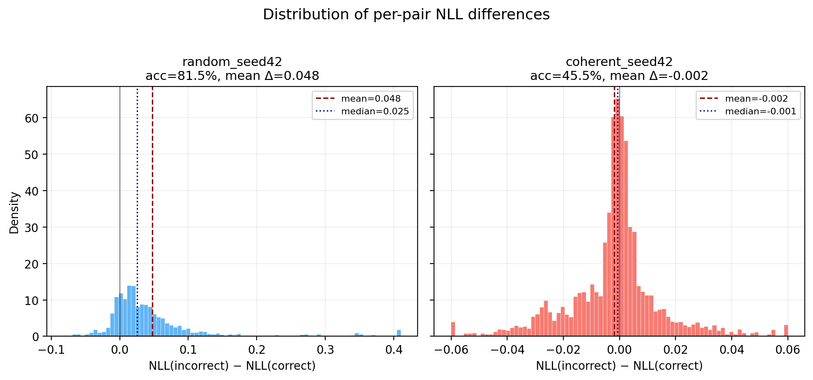

# Compression Favors Consistency, Not Truth: When and Why Language Models Prefer Correct Information

**Author:** Konstantin Krestnikov
**Date:** 03.2026

## Abstract

Why do language models sometimes prefer correct statements even when trained on mixed-quality data? We propose the Compression--Consistency Principle: gradient descent favors the most compressible hypothesis, not truth per se. Truth bias emerges only when false alternatives are harder to compress.

We test this with GPT-2 style character-level transformers (3.5M--86M parameters) on synthetic corpora mixing correct and incorrect mathematical derivations. With random errors, models prefer correct completions 83% of the time at 50/50 and 67% even at 10/90. Replacing random errors with a coherent but wrong rule system eliminates the effect (accuracy ~49% across all model sizes). The compression ratio gap between correct and incorrect completions, measured by gzip on raw text, predicts model behavior across 9 conditions (Spearman rho = 0.68, p = 0.042). A generation sanity check confirms the direction beyond forced-choice evaluation (30.5% vs 20.8% generative accuracy, p = 0.013).

Two boundary conditions emerge: multi-rule errors produce a graded increase in truth bias as rule diversity grows, and embedding verification steps within coherent tasks restores preference for correct completions (43% to 71%). The main implication for alignment: compression alone does not reliably favor truth over well-structured falsehood.

---

## 1. Introduction

Language models are increasingly accurate on factual benchmarks, yet they confidently generate false statements. What determines when a model prefers truth and when it doesn't?

Several explanations have been proposed. Scaling helps: larger models perform better on factual tasks (Kadavath et al., 2022). RLHF and similar alignment techniques steer models toward human-preferred outputs. Data statistics play a role: factual accuracy correlates with the frequency and source reliability of facts in training data (Elazar et al., 2022; Joshi et al., 2024; Kandpal et al., 2023). Internal truth representations have been discovered in model activations (Burns et al., 2023; Marks & Tegmark, 2023). Yet none of these explanations address a more fundamental question: *why would the training objective itself -- next-token prediction -- create any preference for truth?*

We propose that the answer is compression. Minimizing cross-entropy is mathematically equivalent to minimizing code length (Shannon, 1948; Deletang et al., 2024), connecting LLM training to the Minimum Description Length principle (Rissanen, 1978; Grünwald, 2007). A model that better predicts tokens is a better compressor. Compression quality correlates linearly with model capabilities (Huang et al., 2024), and LLM training formally approximates Solomonoff induction (Wan & Mei, 2025). But compression does not inherently favor truth -- it favors the most *compressible* hypothesis consistent with the data. We call this the **Compression--Consistency Principle**: truth benefits from compression only when falsehood is structurally incoherent. Diverse errors must be memorized individually, whereas a correct rule system compresses into a compact representation. When errors form a coherent alternative system -- internally consistent but wrong -- they compress just as efficiently, and the preference vanishes.

Three caveats apply. First, models compress *text*, not reality: "truth" here means correctness of mathematical derivations. Second, frequency can override compressibility. Third, the compressibility gap is corpus-dependent, not universal. We test the principle through 9 experiments on mathematical and natural-language synthetic corpora (Sections 4--7, Appendix B), with models from 3.5M to 86M parameters, under both character-level and BPE tokenization.

The work makes four contributions. (1) A controlled design in which *coherent-false* errors serve as a strong null, isolating compressibility from truth value. (2) Paired evaluation as the primary metric, revealing that corpus-level loss systematically overestimates truth bias (Sections 4.1 and 6). (3) Coherent falsehood removes paired preference across the 3.5M--86M size range, bounding when compression alone aligns with correctness. (4) Quantitative validation: the compression ratio gap (measured by gzip on raw text) predicts model behavior across 9 conditions (Spearman rho = 0.68, p = 0.042), learning curves confirm behavioral convergence, and a generation sanity check shows the same directional effect beyond forced-choice evaluation.

## 2. Related Work

### Prediction as Compression

The link between prediction and data compression traces back to the foundational work in information theory. Shannon (1948) showed that optimal compression requires knowledge of the true data distribution, and Solomonoff (1964) formalized optimal prediction as weighting hypotheses by their program length. Rissanen (1978) developed the Minimum Description Length (MDL) principle, formalizing model selection as a compression task: the best model minimizes the total description length of the model plus the data given the model. Grünwald (2007) systematized the MDL principle and showed its equivalence to several forms of statistical inference. Hutter (2005) developed these ideas into a formal theory of universal artificial intelligence (AIXI), explicitly linking intelligence to compression ability. Our work directly builds on the MDL framework: we experimentally vary the description length of false systems and observe under what conditions the MDL-optimal choice coincides with truth.

In the context of language models, Deletang et al. (2024) empirically demonstrated that LLMs are universal compressors: a next-token predictor can serve as an arithmetic coder. Huang et al. (2024) discovered a linear correlation (r ~ -0.95) between compression quality and benchmark performance, and Wan & Mei (2025) formally proved that LLM training approximates Solomonoff induction. Pan et al. (2025) used compression-based analysis to explain knowledge acquisition, data generation, and scaling behaviors. These results form the theoretical foundation of our work: if LLM training is compression, under what conditions does compression align with behavior that favors correct over incorrect continuations?

### Internal Representations of Truth in LLMs

Several studies have found that language models form internal representations correlated with statement truthfulness. Marks & Tegmark (2023) showed a linear geometric structure of truthfulness in activation space (Geometry of Truth), and Burns et al. (2023) proposed CCS, a method for discovering truth directions without supervision. Li et al. (2023b) identified a 40% gap between a model's internal knowledge and its generation, developing Inference-Time Intervention (ITI). Ravfogel et al. (2025) proposed the Truth Co-occurrence Hypothesis -- a mechanism for the emergence of linear truth representations through co-occurrence of true statements in the corpus. Azaria & Mitchell (2023) showed that internal LLM states can distinguish true from false outputs, and Bürger et al. (2024) demonstrated that lie detection transfers robustly across models and domains. Halawi et al. (2024) analyzed how models process false demonstrations, finding that larger models can "overthink" and revert to memorized facts. At the mechanistic level, Ortu et al. (2024) traced how factual recall in MLP layers competes with counterfactual in-context signals processed by earlier attention heads. Our work complements these representational and mechanistic analyses at the behavioral level: we study when compression produces a paired preference for correct over incorrect continuations in controlled corpora, leaving activation-level analysis for future work.

### Emergent World Models

Language models can form internal world models from pure text prediction. Li et al. (2023a) trained a model to predict Othello moves and found that it learns a full board representation (Othello-GPT). Gurnee & Tegmark (2024) discovered linear representations of space and time in Llama-2 activations. These results show that sequence compression can give rise to structured internal representations. Our work does not probe such representations directly; instead, it asks when compression yields behavioral preference for correct versus incorrect continuations.

### Truthfulness and Training Data Statistics

Several works investigate the dependence of factual behavior on the structure of the training corpus. Joshi et al. (2024) showed that truthfulness in LLMs is linked to the structure of "personas" (sources) in pretraining data: the model learns persona-specific patterns and prefers statements associated with reliable sources. Elazar et al. (2022) demonstrated that factual predictions strongly depend on the frequency of facts in training data. Kang & Choi (2023) investigated how co-occurrence between statements affects factual recall, and Kandpal et al. (2023) showed a direct relationship between the number of supporting documents in the corpus and model answer accuracy. On a more theoretical side, Kalai & Vempala (2024) proved that calibrated language models must hallucinate at a rate tied to the corpus's monofact rate, establishing a statistical lower bound on factual errors. Our work differs from this line in emphasis: frequency clearly matters in our experiments as well, but we *experimentally vary* the structure of errors (their compressibility) while controlling frequencies within each condition. This allows us to isolate one factor beyond frequency and source reliability rather than claiming that data statistics play no role.

### Simplicity Bias, Noisy Labels, and Grokking

The inductive bias of neural networks towards simple functions is a well-documented phenomenon. Valle-Perez et al. (2019) showed an exponential preference for low-complexity functions, and Mingard et al. (2021) proved that SGD approximates Bayesian sampling with a simplicity prior. Goldblum et al. (2024) connected this to Kolmogorov complexity, providing a theoretical basis for the link between compression and generalization. Bhattamishra et al. (2023) showed that transformers exhibit a pronounced simplicity bias, preferring lower-complexity solutions when multiple hypotheses are consistent with the data. In a related direction, Mészáros et al. (2024) studied rule extrapolation in formal languages through a Solomonoff-inspired lens, showing that models can generalize compositionally to OOD prompts when the underlying rules are simple enough.

The noisy labels literature directly parallels our setup. Zhang et al. (2017) demonstrated that neural networks can memorize completely random labels, but when structure is present, they generalize through it. Rolnick et al. (2017) showed that learning is robust to massive label noise -- the network learns the "clean" pattern even when noise overwhelmingly predominates. Our result with random errors (truth bias at 10/90) directly aligns with these observations: random errors play the role of noise labels, through which the network generalizes to structured correct solutions.

The phenomenon of grokking -- delayed generalization -- is also related to compression. Nanda et al. (2023) showed that networks discover Fourier transforms for modular arithmetic, and DeMoss et al. (2024) described the phase transition from memorization to generalization through complexity dynamics. Liu et al. (2023) interpreted grokking as a compression process: the network transitions from memorization to a compact representation. Our experiments with coherent errors directly connect to simplicity bias: a coherent false system is just as "simple" as truth, and compression shows no preference for either.

### Our Contribution

The works above either study internal truth representations in trained models, establish theoretical links between compression and intelligence, or analyze the dependence of truthfulness on data statistics. To our knowledge, direct training experiments with systematic variation of *error compressibility* remain limited. This work contributes one such controlled study. Unlike frequency-based analyses (Elazar et al., 2022; Kandpal et al., 2023; Joshi et al., 2024), we fix frequency and vary error structure, showing that at 50/50, truth bias is 83% for random errors but 49% for coherent ones. Unlike representational studies (Burns et al., 2023; Marks & Tegmark, 2023; Ravfogel et al., 2025), we train from scratch and identify behavioral conditions under which paired preference appears or disappears. Unlike noisy-label work (Zhang et al., 2017; Rolnick et al., 2017), we show that "structured noise" (coherent errors) is not filtered out. Our results complement the statistical hallucination bound of Kalai & Vempala (2024) by identifying a compression-based mechanism: coherent falsehood remains attractive regardless of rarity.

## 3. Methodology

### 3.1 Model and Training

GPT-2 style decoder-only transformer implemented in MLX. Pre-norm (LayerNorm before attention/MLP), GELU activation, causal mask.

| Config | Layers | d_model | Heads | Parameters |
|--------|--------|---------|-------|------------|
| tiny | 4 | 256 | 4 | 3.5M |
| small | 6 | 384 | 6 | 11M |
| medium | 8 | 512 | 8 | 26M |
| large | 12 | 768 | 12 | 86M |

Experiments 1--3 use the tiny config; Experiment 4 (Section 7) repeats the key conditions across all sizes up to large (86M). Optimizer: AdamW (weight_decay=0.01), cosine decay with linear warmup (200 steps), lr=3e-4, seq_len=256, batch_size=32, 5000 steps. All experiments are repeated with 4 random initializations (seeds 42--45).

**Justification for the number of seeds.** Most conditions are repeated with 4 random initializations. This is sufficient to show whether the direction of an effect is stable across runs, but it does **not** tightly estimate between-run uncertainty. We therefore use seed-level summaries as the main unit for training variability, and report paired-test statistics within each seed as a separate source of evidence about the behavior of one trained model on many held-out items. Combined tests across several conditions are reported only as omnibus support; they are not a substitute for condition-specific replication.

### 3.2 Corpus Generation

The generator creates mathematical problems of four types: multi-step arithmetic, factorization, equation solving, and differentiation. Each problem is formatted as a step-by-step solution in English, verified by SymPy. The tokenizer is character-level (vocab size = 57) to exclude BPE artifacts as a confound.

**Error Types:**
- **Random:** Injection of one plausible error at a random step (sign, coefficient, distributivity error). Each error is unique.
- **Coherent:** One systematic incorrect rule per problem type (e.g., a × b = a × (b−1); sign is preserved when moving terms across =; etc.). All problems of one type fail identically.
- **Contradictory:** Simple rules (a + b = a + b + 1; a - b = a - b - 2) that break algebraic structure -- addition and subtraction cease to be inverse operations.

### 3.3 Metrics

**Paired evaluation (primary metric).** For each problem, a single shared prompt is generated along with two completions (correct and incorrect). NLL is computed only on completion tokens, conditioned on the shared prompt. This yields pairwise comparison under identical context, eliminating the confound of different prompts. Metrics: **pair accuracy** (fraction of pairs where the model prefers correct; our primary metric), mean DLoss on completions, one-sided Wilcoxon signed-rank test. We adopt paired evaluation as the primary metric because corpus-level measures can be confounded by differences in text statistics between correct and incorrect corpora (see Sections 4.1 and 6 for concrete examples of such divergence).

As an auxiliary robustness check for the central math conditions, we also store two additional paired summaries: total NLL over completion tokens and length-matched mean NLL, which averages only over the shared minimum completion length in each pair. These variants preserve the main sign pattern in the key math comparisons (random 50/50, random 10/90, coherent 50/50), so the reported mean completion-token NLL remains the primary paired metric.

**Corpus-level evaluation (secondary diagnostic).** We report two corpus-level variants. The legacy estimate samples random windows from the concatenated correct and incorrect token streams; this preserves continuity with earlier artifacts but is sensitive to local formatting and stream boundaries. As a robustness check, we also run a deterministic example-block evaluation that scores every held-out problem separately without crossing example boundaries. In both cases **DLoss = Loss(incorrect) - Loss(correct)**; a positive value indicates lower loss on correct examples. We treat these corpus-level measures as diagnostics rather than as the main truth-bias metric.

**Statistical analysis.** Each configuration is repeated with 4 random initializations (seeds 42--45), except where noted otherwise. For training variability we report seed-level effect sizes, means across seeds, and dispersion across seeds. For individual configurations we use the two-sided binomial test on seed directions as a small-sample directional check. For paired evaluation, the **one-sided** Wilcoxon signed-rank test (`alternative='greater'`) is applied to paired NLL differences within a single trained model; this quantifies uncertainty over held-out pairs, not uncertainty over the training procedure. 95% confidence intervals for DLoss are obtained via bootstrap and should be interpreted at the corresponding level of aggregation.

### 3.4 Theoretical Framework: Description Length and Theory Types

To interpret Experiments 2--3 we use a typology of theories distinguished by the description length of the corpus "theory + observations." The key principle: the model optimizes cross-entropy, which is equivalent to minimizing expected code length (Shannon, 1948). A theory that allows shorter encoding of the corpus gains an advantage.

**Type 1: True theory with concrete predictions.** Predictions match observations. The "theory + observations" corpus compresses maximally: one rule system explains everything.

**Type 2: False theory with concrete predictions.** Predictions diverge from observations. The model must encode both the false rules and the discrepancies. However, if the discrepancies are **regular** (e.g., a × b = a × (b−1) always understates by a), the model can learn a correction, and the additional description length is small.

**Type 3a: Theory with non-specific predictions.** The theory does not specify a "situation -> outcome" mapping (e.g., "result is moderate"). It does not contradict observations but does not help predict them either -- it does not reduce code length.

**Type 3b: Theory with ad hoc correction.** Each discrepancy is explained by a unique exception rule. Description length grows linearly with the number of observations -- this is anti-compression.

### 3.5 MDL Heuristic Framing: When Does Compression Favor Truth

We state a heuristic MDL interpretation (Rissanen, 1978; Grünwald, 2007). Consider a corpus $D$ consisting of $N$ problems, fraction $\alpha$ solved according to a true theory $T_1$ and fraction $(1 - \alpha)$ according to an alternative theory $T_2$. An idealized MDL learner would minimize the two-part code $L(M) + L(D|M)$, where $L(M)$ is model description length and $L(D|M)$ is data length given the model. The discussion below is intended as intuition for the experiments, not as a formal theorem about finite SGD-trained transformers.

**Heuristic picture.** Let $K(T_1)$ and $K(T_2)$ denote informal description lengths of theories $T_1$ and $T_2$. Then:

1. **$K(T_2) \gg K(T_1)$ (random errors).** If false completions require many idiosyncratic exceptions, the effective description length of the false system grows with corpus size. In that regime, an MDL-style learner should tend to favor $T_1$ even when $\alpha < 0.5$, provided the compressibility advantage is large enough relative to model capacity and frequency.

2. **$K(T_2) \approx K(T_1)$ (coherent errors).** If both systems are described by compact rules of comparable complexity, frequency should dominate. At $\alpha = 0.5$ an idealized MDL learner has little reason to prefer one system over the other.

3. **$K(T_2) > K(T_1)$, but $K(T_2) = O(1)$ (multi-rule errors).** Multiple alternative rules increase the description length of the false system while keeping it structured. The resulting preference for $T_1$ should depend on how unpredictable rule selection is relative to the one-rule coherent baseline. This prediction requires matched paired evaluation on the same prompt distribution.

Experiments 1, 4, and 6 directly test the first two predictions. The random/coherent contrast is consistent with the MDL framing: truth bias is large for random errors ($\approx$83% paired accuracy) and near chance for coherent errors ($\approx$49%). The rebuilt matched multi-rule experiment also fits the same qualitative picture: increasing rule diversity raises pair accuracy from 46.6% at `N=1` to 88.3% at `N=10`.


*Figure 1. The Compression--Consistency Principle. (a) MDL prediction: description length of truth $K(T_1)$ is constant, while description length of falsehood $K(T_2)$ depends on error structure -- equal for coherent errors, increasing for multi-rule, maximal for random. (b) The current experiments support the random/coherent contrast and show a graded matched multi-rule curve, with the largest increase between `N=1` and `N=2` and continued growth thereafter.*

**Quantitative compressibility measurement.** To operationalize the MDL argument, we measure the compression ratio of correct vs. incorrect completion segments using gzip (level 9) on concatenated completions from each paired test set (thousands of completions per condition, to ensure that compressor header overhead does not dominate). The compression ratio delta (incorrect minus correct) provides a proxy for the compressibility gap between correct and incorrect completions, independent of any trained model.

**Table C1.** Compression ratio (gzip) of correct vs incorrect completion segments.

| Condition | Correct | Incorrect | Delta | Paired accuracy |
|-----------|:-------:|:---------:|:-----:|:--------------:|
| random | 0.1627 | 0.1639 | +0.0012 | 83.1% |
| coherent | 0.1656 | 0.1658 | +0.0002 | 47.2% |
| contradictory | 0.1745 | 0.1744 | -0.0001 | 49.0% |
| multirule N=2 | 0.1671 | 0.1710 | +0.0038 | 77.6% |
| multirule N=3 | 0.1669 | 0.1722 | +0.0053 | 82.8% |
| multirule N=5 | 0.1672 | 0.1730 | +0.0057 | 84.8% |
| multirule N=10 | 0.1676 | 0.1752 | +0.0076 | 88.3% |
| world random | 0.0370 | 0.0516 | +0.0146 | 57.7% |
| world coherent | 0.0374 | 0.0384 | +0.0010 | 46.6% |


*Figure 2. Error compressibility predicts truth bias. Compression ratio delta (gzip, incorrect minus correct completions) vs paired accuracy across all conditions. Spearman rho = 0.68, p = 0.042. Coherent and contradictory errors cluster near zero delta and chance accuracy; random and multi-rule errors show progressively larger delta and higher accuracy. The synthetic world domain shows the same qualitative pattern but at a different scale.*

The rank correlation is significant (Spearman rho = 0.68, p = 0.042), confirming that the compressibility gap between correct and incorrect completions -- measurable by a generic compressor without any trained model -- predicts whether gradient-descent-trained models will exhibit truth bias. Within the math domain, the multi-rule series shows a monotonic relationship: N=2 -> N=3 -> N=5 -> N=10 maps to progressively larger compression deltas and higher paired accuracy. Coherent and contradictory errors have near-zero delta and near-chance accuracy. The Pearson correlation is lower (r = 0.27, p = 0.49) due to the synthetic world being an outlier -- large compression delta but modest accuracy, likely because the tiny model extracts less structure from natural language than from formal math.

### 3.6 Experiment Conditions

**Experiment 1:** 5 proportions (50/50--10/90) x 4 seeds = 20 models with random errors + 1 baseline. Controls: coherent errors (4 proportions x 4 seeds = 16) and contradictory (4 seeds).

**Experiment 2:** Coherent errors at 50/50 with observations. 4 observation ratios (0%, 10%, 25%, 50%) x 4 seeds = 16 models. Test sets contain no observations -- we measure pure mathematical prediction quality.

**Experiment 3:** 5 conditions for the false theory (A--E) at 50/50. Conditions A and B are from Experiments 1--2. Conditions C, D, E -- 3 x 4 seeds = 12 new models.

**Experiment 4:** Scaling -- random 50/50 is replicated across small (11M), medium (26M), and large (86M) sizes with 4 seeds per size in the released artifact set. Coherent 50/50 is now released with 4 seeds at each size from tiny through large. These comparisons are interpreted as fixed-step trends, not as compute-matched scaling laws. **Experiment 5:** Multi-rule errors (matched paired evaluation). **Experiment 9:** Chained tasks with verification. Additional experiments reported in Appendix B: synthetic world, multi-alternative errors, and cross-domain falsification.

## 4. Experiment 1: Random, Coherent, and Contradictory Errors

**Hypothesis.** If compression gives rise to truth bias, then models trained on a mixture of correct and incorrect derivations should show lower loss on correct examples (DLoss > 0), with the effect depending on error coherence: random (incoherent) errors -> strong bias; coherent (systematic) -> weak or zero.

### 4.1 Truth Bias with Random Errors

**Table 1.** Loss on held-out test sets, averaged over 4 seeds. DLoss = Loss(incorrect) - Loss(correct); positive value = truth bias.

| Proportion (cor/inc) | Loss (correct) | Loss (incorrect) | DLoss | 95% CI (bootstrap) | Seeds -> correct |
|----------------------|----------------|------------------|-------|---------------------|------------------|
| 100/0 (baseline) | 0.1313 | 0.2028 | +0.0715 | -- | 1/1 |
| 50/50 | 0.1384 +/- 0.0009 | 0.1499 +/- 0.0008 | +0.0115 +/- 0.0002 | [+0.0113, +0.0116] | 4/4 |
| 40/60 | 0.1403 +/- 0.0006 | 0.1492 +/- 0.0003 | +0.0089 +/- 0.0003 | [+0.0087, +0.0092] | 4/4 |
| 30/70 | 0.1422 +/- 0.0009 | 0.1486 +/- 0.0004 | +0.0064 +/- 0.0006 | [+0.0060, +0.0069] | 4/4 |
| 20/80 | 0.1455 +/- 0.0007 | 0.1487 +/- 0.0006 | +0.0033 +/- 0.0002 | [+0.0031, +0.0034] | 4/4 |
| **10/90** | **0.1503 +/- 0.0003** | **0.1487 +/- 0.0001** | **-0.0016 +/- 0.0003** | **[-0.0019, -0.0013]** | **0/4** |


*Figure 3. Left: DLoss as a function of the correct data fraction. Truth bias is maintained up to 20/80 and inverts at 10/90 at the corpus level. Right: absolute loss -- the lines cross at roughly 15%.*

Corpus-level truth bias decreases strictly monotonically: +0.0115 -> +0.0089 -> +0.0064 -> +0.0033 -> -0.0016. The corpus-level tipping point lies between 10% and 20% correct data. Compression pressure beats frequency bias up to a fourfold prevalence of incorrect data.

An asymmetry is observed: the loss on correct examples increases substantially (0.1384 -> 0.1503), while the loss on incorrect ones remains nearly stable (0.1499 -> 0.1487). The entire dynamic is driven by the model's ability to learn the rules of correct mathematics.

Statistical significance: 16/16 seeds prefer correct examples at proportions 50/50--20/80. Two-sided binomial test: p = 3.05 x 10^-5. For each proportion individually (4/4 seeds) p = 0.125, which is not significant. The combined test is therefore best viewed as omnibus support across several related conditions rather than as a substitute for condition-specific replication.

However, paired evaluation (see below) shows that even at 10/90 the model retains truth bias at the pair level -- the corpus-level inversion reflects a frequency effect, not a loss of the structural advantage of correct solutions.

**Deterministic full-test robustness check.** The main table above uses the legacy random-window estimator for continuity with earlier artifacts, but a deterministic example-block evaluation preserves the key sign pattern in the central conditions. At random 50/50 it yields **DLoss = +0.0157**; at random 10/90 it still yields **DLoss = +0.0025** rather than an inversion; and at coherent 50/50 it yields **DLoss = -0.0008**. The methodological conclusion is therefore unchanged: the strongest evidence for truth bias comes from paired evaluation, while corpus-level estimates are best treated as secondary diagnostics whose exact magnitude depends on the evaluation procedure.

**Paired evaluation (50/50, random errors).** To eliminate the confound of different prompts, we conducted paired evaluation on 4,951 problem pairs with a shared prompt and two completions. This provides a clearer estimate of the effect:

**Table 1a.** Paired evaluation at 50/50 (random errors). DLoss = NLL(incorrect) - NLL(correct) on completion tokens.

| Seed | DLoss (paired) | Pair accuracy | 95% CI | Wilcoxon p |
|------|:-:|:-:|:-:|:-:|
| 42 | +0.0478 | 81.5% | [+0.046, +0.050] | <10^-6 |
| 43 | +0.0494 | 84.2% | [+0.047, +0.052] | <10^-6 |
| 44 | +0.0483 | 86.0% | [+0.046, +0.050] | <10^-6 |
| 45 | +0.0465 | 80.8% | [+0.044, +0.049] | <10^-6 |
| **Avg** | **+0.0480** | **83.1%** | -- | -- |

Given the same prompt, the model assigns lower NLL to the correct solution 83% of the time. The effect is ~4x larger than the corpus-level estimate (+0.048 vs +0.012), since the paired metric isolates the diverging portion of the solution from the shared problem format.

By problem type, the effect varies: algebra (accuracy 99.9%) > arithmetic (94%) > derivatives (72%) > equations (65%). Algebra shows the cleanest signal: the model virtually always prefers the correct factorization.

**Paired evaluation across proportions.** The effect decreases monotonically but remains significant at all proportions:

**Table 1b.** Paired evaluation across proportions (random errors, 4 seeds, Wilcoxon p < 10^-6 for all).

| Proportion | Avg DLoss (paired) | Pair accuracy | Corpus DLoss |
|:----------:|:------------------:|:------------:|:------------:|
| 50/50 | +0.048 | 83% | +0.0115 |
| 40/60 | +0.043 | 79% | +0.0089 |
| 30/70 | +0.036 | 75% | +0.0064 |
| 20/80 | +0.029 | 69% | +0.0033 |
| **10/90** | **+0.017** | **67%** | **-0.0016** |

At 10/90, the corpus-level metric inverts (DLoss = -0.0016, the model on average "prefers" incorrect examples due to their 9-fold prevalence), while paired evaluation consistently shows truth bias (67% accuracy, p < 10^-88). This means that the structural advantage of correct solutions persists even under extreme imbalance -- the corpus-level inversion reflects a frequency effect on shared problem patterns, not a loss of the model's discriminative ability at the level of individual solutions.

### 4.2 Coherent Errors: Disappearance of Truth Bias

**Table 2.** Three error types at the 50/50 proportion.

| Error Type | Loss (correct) | Loss (incorrect) | DLoss | 95% CI | Seeds -> correct |
|---|---|---|---|---|---|
| Random | 0.1384 +/- 0.0009 | 0.1499 +/- 0.0008 | **+0.0115 +/- 0.0002** | [+0.0113, +0.0116] | **4/4** |
| Contradictory | 0.1406 +/- 0.0009 | 0.1411 +/- 0.0008 | **+0.0005 +/- 0.0001** | [+0.0004, +0.0006] | **4/4** |
| Coherent | 0.1374 +/- 0.0005 | 0.1370 +/- 0.0008 | **-0.0004 +/- 0.0004** | [-0.0006, -0.0001] | **0/4** |


*Figure 4. Coherence spectrum: DLoss for three error types at 50/50. The less consistent the error system, the stronger the truth bias.*

The results form a spectrum: random errors (a maximally incoherent "theory") yield strong bias; contradictory ones (simple rules that break algebra) yield a weak one; coherent ones (a consistent system) yield zero bias.

**Paired evaluation sharpens the spectrum.** Paired evaluation (same prompt, two completions) reinforces the picture:

**Table 2a.** Paired evaluation for three error types at 50/50 (4 seeds).

| Error Type | Avg DLoss (paired) | Pair accuracy | Wilcoxon p |
|---|:-:|:-:|:-:|
| Random | **+0.048** | **83%** | <10^-6 |
| Contradictory | +0.0003 | 49% | >0.3 |
| Coherent | -0.0018 | 47% | ~1.0 |

Given the same prompt, the model prefers correct only for random errors. For coherent and contradictory errors, accuracy remains near chance. This eliminates the prompt confound and is consistent with the interpretation that truth bias here depends on error incompressibility rather than on "truthfulness" in the abstract.

### 4.3 Coherent Errors at Different Proportions

**Table 3.** Random vs. coherent errors across proportions.

| Proportion | Random DLoss | Coherent DLoss | Random -> | Coherent -> |
|---|---|---|---|---|
| 50/50 | +0.0115 +/- 0.0002 | -0.0004 +/- 0.0004 | correct (4/4) | incorrect (0/4) |
| 40/60 | +0.0089 +/- 0.0003 | -0.0041 +/- 0.0002 | correct (4/4) | incorrect (0/4) |
| 30/70 | +0.0064 +/- 0.0006 | -0.0083 +/- 0.0003 | correct (4/4) | incorrect (0/4) |
| 20/80 | +0.0033 +/- 0.0002 | -0.0143 +/- 0.0006 | correct (4/4) | incorrect (0/4) |

With random errors, truth bias withstands frequency up to 20/80. With coherent errors, DLoss is negative at all proportions: the model slightly prefers the incorrect system even at 50/50, and this preference strengthens as the share of incorrect data grows. The model follows pure frequency -- preferring whichever type is more abundant (or easier to compress at equal proportions). **Truth bias with random errors is a consequence of the incompressibility of ad hoc errors, not an intrinsic property of data "truthfulness."**

**Paired evaluation sharpens the contrast.** For coherent errors, paired evaluation reveals a symmetric picture: the model prefers whichever system is in the majority.

**Table 3a.** Paired evaluation for coherent errors across proportions (4 seeds).

| Proportion | Random accuracy | Coherent accuracy | Coherent DLoss (paired) |
|:---------:|:-------------:|:-----------------:|:--------------------:|
| 50/50 | 83% | 47.2% | -0.002 |
| 40/60 | 79% | 27.8% | -0.009 |
| 30/70 | 75% | 14.7% | -0.019 |
| 20/80 | 69% | 9.6% | -0.033 |

The contrast is striking: at 20/80, the model with random errors still prefers truth (69%), whereas the model with coherent errors actively prefers the false system (accuracy 9.6%, i.e. in 91% of pairs the model assigns lower NLL to the coherent-incorrect solution). Truth has no privilege -- when compressibility is equal, frequency wins.


*Figure 5. Loss across seeds: points above the diagonal indicate truth bias. Coherent errors (diamonds) lie on the diagonal.*

## 5. Experiment 2: Observations and Predictive Power

**Hypothesis.** Adding empirical feedback (observations) should increase the description length of the false theory by introducing discrepancies, thereby restoring truth bias for coherent errors.

Experiment 1 showed that a coherent false system compresses just as well as the correct one. But in the real world, false theories diverge from observations. We add a verification component:

```
# Correct theory: a x b = a*b
Prediction: total = 50
Observation: counted 50 items [check]

# Coherent false: a x b = a*(b-1)
Prediction: total = 40
Observation: counted 50 items [cross]
```

**Table 4.** Impact of observation ratio on truth bias (coherent errors, 50/50).

| Observation % | Avg DLoss | 95% CI | Seeds -> correct | p (binom) | Avg Loss (correct) |
|:---:|:---:|:---:|:---:|:---:|:---:|
| 0% (control)* | +0.0005 +/- 0.0003 | [+0.0002, +0.0007] | 4/4 | 0.125 | 0.1414 |
| 10% | +0.0002 +/- 0.0003 | [-0.0001, +0.0004] | 3/4 | 0.625 | 0.1416 |
| 25% | +0.0004 +/- 0.0001 | [+0.0003, +0.0004] | 4/4 | 0.125 | 0.1435 |
| 50% | +0.0008 +/- 0.0006 | [+0.0003, +0.0012] | 3/4 | 0.625 | 0.1471 |


*Figure 6. DLoss as a function of the observation ratio. The effect is an order of magnitude weaker than with random errors (+0.0115).*

*\*Note: the control condition (0% observations) uses models from Experiment 2, trained on a separately generated corpus with the same 50/50 ratio. Its DLoss = +0.0005 differs slightly from the -0.0004 reported for coherent errors in Table 2 (Experiment 1), because these are different training corpora with different random problem instances. Both values are within noise and consistent with the absence of truth bias, as confirmed by paired evaluation (accuracy ~49% for both model sets).*

**Result: the hypothesis is not supported.** Observations do not restore strong truth bias. DLoss remains within the +0.0002 to +0.0008 range. The reason: discrepancies between the false theory and observations are themselves **regular** (the a × b = a × (b−1) rule always understates by a), and the model learns this regularity as an additional rule.

The 100% observations condition led to a loss explosion (~0.32): the corpus became too complex for the tiny model at 5000 steps. These results are excluded.

## 6. Experiment 3: Informational Overhead of Correction

**Hypothesis.** If bare discrepancies fail to produce a strong bias due to their regularity, then ad hoc explanations -- unique for each discrepancy -- should be incompressible and restore truth bias. Expected ordering: C (ad hoc) > B (bare discrepancies) > E (non-specific) > D (systematic correction) ~ A (no observations).

Five conditions for the false theory (the correct theory is identical across all):

**A: No observations** (baseline) -- theory without verification.

**B: Bare discrepancies** (Experiment 2, 50% observations) -- theory with discrepancies.

**C: Ad hoc correction** -- a unique explanation for each discrepancy:
```
Prediction: 10 × 5 = 40. Observation: counted 50.
Explanation: In this case 5 is prime, so we add the base once more.
Corrected: 40 + 10 = 50 [check]
```
Each Explanation is unique -- the model cannot compress them into a single rule.

**D: Systematic correction** -- a single correction rule for all discrepancies:
```
Correction rule: always add first operand.
Corrected: 40 + 10 = 50 [check]
```
One rule for all problems -- compressible.

**E: Non-specific predictions** -- theory without a concrete mapping:
```
Prediction: result is moderate. Observation: counted 50.
```

### Results

To test whether conditions C/D/E produce transferable truth bias, we begin with paired evaluation -- the most reliable metric, isolating preference for correctness from textual confounds.

**Table 5a.** Paired evaluation of conditions C/D/E (coherent pairs, 4 seeds).

| Condition | Avg DLoss (paired) | Pair accuracy | Wilcoxon p |
|-----------|:------------------:|:------------:|:----------:|
| C (ad hoc) | -0.0019 | 48.2% | >0.3 |
| D (systematic) | -0.0011 | 49.7% | >0.3 |
| E (non-specific) | -0.0007 | 49.6% | >0.3 |

**Paired evaluation reveals no truth bias for any of the C/D/E conditions.** Pair accuracy ~49% -- at chance level. Training with observations and correction **does not produce transferable truth bias**: the model learns to process correction patterns within the training corpus context, but does not transfer this discrimination to pure mathematical pairs without observations.

**The corpus-level metric, by contrast, registers a non-zero effect.** This divergence is methodologically significant:

**Table 5b.** Corpus-level DLoss across five conditions (tiny, 3.5M, 50/50, 4 seeds).

| Condition | Description | Avg DLoss | 95% CI | Seeds -> correct |
|-----------|-------------|-----------|--------|------------------|
| A | No observations | +0.0005 +/- 0.0003 | [+0.0002, +0.0007] | 4/4 |
| B | Bare discrepancies | +0.0008 +/- 0.0006 | [+0.0003, +0.0012] | 3/4 |
| E | Non-specific predictions | +0.0015 +/- 0.0009 | [+0.0008, +0.0023] | 4/4 |
| C | Ad hoc correction | +0.0025 +/- 0.0008 | [+0.0020, +0.0033] | 4/4 |
| D | Systematic correction | +0.0026 +/- 0.0005 | [+0.0021, +0.0030] | 4/4 |


*Figure 7. Corpus-level DLoss for five conditions. The ordering D ~ C > E > B ~ A does not reflect a preference for correctness, but is an artifact of differences in text statistics (see Table 5a).*

The actual corpus-level ordering is D ~ C > E > B ~ A. The predicted ordering (C > B > E > D ~ A) was partially confirmed: A ~ 0 and B < E < C hold, but D ~ C instead of the expected D ~ A. However, the divergence between corpus-level and paired evaluation suggests that **most of the corpus-level effect for conditions C/D/E is driven by differences in text statistics** (different length and format of correct vs. incorrect corpora), rather than by preference for correctness given the same prompt.

**Caveat:** Absolute loss varies substantially (A: 0.14, B: 0.15, C: 0.23, D: 0.24, E: 0.25), reflecting varying corpus lengths. Models C/D/E are undertrained compared to A/B.

**Methodological takeaway.** This result demonstrates the importance of paired evaluation: corpus-level DLoss can systematically overestimate truth bias when correct and incorrect corpora differ in format, length, or style. The only reliable source of truth bias is **incoherence of the errors themselves** (Experiment 1, random errors), confirmed by both metrics.

## 7. Experiment 4: Scaling, Multi-Rule Errors, and Chained Verification

**Hypothesis.** If truth bias is driven by a structural advantage in compression, then increasing model capacity may strengthen the effect by improving learning of regularities. Coherent errors are expected to remain difficult to distinguish from truth.

### 7.1 Model Configurations

| Size | Parameters | d_model | Heads | Layers |
|------|-----------|---------|-------|--------|
| tiny | 3.5M | 256 | 4 | 4 |
| small | 11M | 384 | 6 | 6 |
| medium | 26M | 512 | 8 | 8 |
| large | 86M | 768 | 12 | 12 |

All models trained for 5000 steps on the same corpus. Architecture: GPT-2 (decoder-only transformer) with character-level tokenization. Random-error and coherent scaling are both released with 4 seeds at each size. Chained tasks use 2 large seeds due to computational constraints.

### 7.2 Results: Fixed-Step Size Trend for Random Errors

**Table 6.** Paired evaluation (random 50/50) by model size.

| Size | Parameters | Avg DLoss (paired) | Pair accuracy | Corpus DLoss | Seeds |
|------|-----------|:------------------:|:------------:|:------------:|:-----:|
| tiny | 3.5M | +0.048 | 83.1% | +0.0115 | 4 |
| small | 11M | +0.063 | 88.4% | +0.0129 | 4 |
| medium | 26M | +0.067 | 88.4% | +0.0130 | 4 |
| large | 86M | +0.070 | 89.1% | +0.0127 | 4 |

**Table 6a.** Paired accuracy by problem type.

| Type | Tiny (3.5M) | Small (11M) | Medium (26M) | Large (86M) |
|------|:-----------:|:-----------:|:------------:|:-----------:|
| Algebra | 99.9% | 100.0% | 100.0% | 100.0% |
| Arithmetic | 95.2% | 98.2% | 98.6% | 99.2% |
| Derivatives | 72.4% | 81.6% | 82.4% | 81.9% |
| Equations | 65.9% | 72.8% | 72.1% | 75.5% |


*Figure 8. Fixed-step size trend. Left: pair accuracy rises from 83.1% (tiny) to 89.1% (large) for random errors, while coherent-error accuracy stays near chance across the released `3.5M`--`86M` runs. Right: paired DLoss by model size.*

In the available fixed-step runs, pair accuracy rises from 83.1% (tiny) to 89.1% (large), with the largest gain between tiny and small. Between small and medium, accuracy is nearly flat (88.4% -> 88.4%), and the large model adds a smaller further increase. Improvement is concentrated in the harder problem types (derivatives and equations), while algebra and arithmetic are already close to saturation at small scale.

**Coherent errors show no truth bias -- and may slightly favor falsehood at small scale.** With full released coverage, coherent pair accuracy remains close to chance across the entire `3.5M`--`86M` range: `47.2%` at tiny, `49.6%` at small, `52.6%` at medium, and `51.4%` at large. Mean paired DLoss is correspondingly near zero at every size (`-0.0018`, `-0.0006`, `-0.0001`, `-0.0001`). The coherent curve therefore does not show a clean monotonic separation trend; under fixed-step training it stays approximately flat around chance.

**Below-chance accuracy at small scale.** The tiny model's coherent accuracy of 47.2% is consistently below 50%, and this pattern replicates across independent setups: BPE tokenization (45.9%), synthetic world (46.6%), and denoising with contradictory examples (43.5%). A likely explanation is *description length asymmetry*: the coherent false rules used in our experiments happen to be slightly simpler than the true rules (e.g., "derivative of $x^n$ is $x^{n+1}$" vs "$n \cdot x^{n-1}$" -- the false rule has no coefficient). A capacity-limited model that cannot fully memorize both systems will slightly favor the shorter-description alternative. As model capacity grows (small and above), accuracy converges to 50%, consistent with the model learning both systems without compression pressure to choose. This observation reinforces rather than undermines the main claim: truth has no inherent privilege under compression -- when errors are equally compressible, a simpler falsehood can even be preferred.

**Learning curves and behavioral convergence.** A potential confound in fixed-step scaling is that larger models may be undertrained: 86M parameters trained for 5000 steps may not have converged. To address this, we evaluate paired accuracy at each saved checkpoint (every 1000 steps) for all model sizes.


*Figure 9. Learning curves for all model sizes. Top: training loss vs step. Bottom: paired accuracy vs step. Random-error models (blue) show accuracy plateauing by step 3000--4000 at all sizes. Coherent-error models (red) remain near chance throughout training.*

**Table LC1.** Paired accuracy at intermediate checkpoints (random 50/50, seed 42, 500-pair eval).

| Step | Tiny | Small | Medium | Large |
|------|:----:|:-----:|:------:|:-----:|
| 1000 | -- | 65.4% | 68.8% | 72.6% |
| 2000 | -- | 77.2% | 79.4% | 80.4% |
| 2500 | 72.2% | -- | -- | -- |
| 3000 | -- | 85.4% | 84.6% | 88.8% |
| 4000 | -- | 87.2% | 87.4% | 88.0% |
| 5000 | 80.4% | 83.4% | 86.2% | 86.2% |

All sizes reach a behavioral plateau by step 3000--4000: paired accuracy stabilizes or shows only minor fluctuation thereafter. The large model achieves 88.8% at step 3000 and remains within 2 percentage points through step 5000. Coherent-error models show no trend at any checkpoint, remaining within 40--56% across all steps and sizes. This rules out the hypothesis that the large model is substantially undertrained: its behavioral convergence precedes the fixed training endpoint, and the convergence-matched scaling concern (Section 8.4) is therefore mitigated without requiring additional training runs.

**Scaling summary.** Under fixed-step training (5000 steps for all sizes), the released random-error runs show a positive size trend in the `3.5M`--`86M` range, while the released coherent runs remain near chance across the same size range. Learning curves confirm that behavioral convergence is reached before the 5000-step endpoint at all sizes, so the observed size trend reflects capacity differences rather than differential convergence. The safer conclusion remains that, under this training setup, larger random-error models show stronger paired preference for correct completions, whereas coherent falsehood remains difficult to distinguish from truth.

### 7.3 Experiment 5: Multi-Rule (Conspiratorial) Errors

Experiments 1 and 4 established two poles: coherent errors (one rule per task type) yield near-chance paired accuracy, while random errors yield strong preference for correct completions. The question is what happens in between.

We introduce *multi-rule errors*: for each task type, a pool of N alternative wrong rules is created, and for each problem, one rule is chosen at random. Each rule is itself compact, but the mapping "problem -> rule" is unpredictable. Conceptually, this should increase the description length of the false system relative to the one-rule coherent case.

**Table 7.** Matched paired evaluation of multi-rule errors (tiny, 3.5M, 50/50, 4 seeds).

| N rules | Avg Accuracy | Avg DLoss (paired) | Range of seed bootstrap CIs for DLoss | Wilcoxon p |
|:-------:|:----------:|:-----------------:|:------------:|:----------:|
| 1 (coherent baseline) | 46.6% | -0.0019 | [-0.0032, -0.0005] | ~1.0 |
| 2 | 77.6% | +0.0152 | [+0.0137, +0.0171] | < 10^-6 |
| 3 | 82.8% | +0.0213 | [+0.0197, +0.0229] | < 10^-6 |
| 5 | 84.8% | +0.0293 | [+0.0271, +0.0310] | < 10^-6 |
| 10 | 88.3% | +0.0440 | [+0.0413, +0.0462] | < 10^-6 |
| inf (random benchmark) | 83.1% | +0.0480 | [+0.0460, +0.0500] | < 10^-6 |


*Figure 10. Matched paired evaluation for multi-rule errors. The coherent baseline (`N=1`) is evaluated on a matched one-rule paired test, and each `N >= 2` condition is evaluated on its own multi-rule paired benchmark. The resulting curve is steepest between `N=1` and `N=2`, but then continues to grow gradually rather than exhibiting a single discontinuous jump.*

Three observations follow from the matched evaluation:

1. **The effect is real under matched evaluation.** Evaluating each multi-rule condition on its own paired benchmark yields 46.6% at `N=1`, 77.6% at `N=2`, and 88.3% at `N=10`. Comparing multi-rule models against a single-rule paired test (as done in the initial analysis) would overstate the effect by mixing evaluation families; matched tests are therefore used throughout.

2. **The largest increase is between one rule and two rules, but the curve remains graded.** The move from `N=1` to `N=2` produces the biggest change, yet additional rules continue to strengthen the effect (`77.6% -> 82.8% -> 84.8% -> 88.3%`).

3. **Multi-rule errors do not dominate the random benchmark at every `N`.** At `N=2`, the matched result is weaker than the random benchmark (77.6% vs 83.1%). By `N=10`, it exceeds the tiny random benchmark numerically, but the correct interpretation is not "multi-rule is always harder than random." It is that increasing rule diversity can progressively erode the compressibility advantage of the false system.

Three additional experiments -- a synthetic natural-language world (Experiment 6), multi-alternative errors in natural language (Experiment 7), and cross-domain falsification with separate task types (Experiment 8) -- are reported in Appendix B. In brief: truth bias appears in natural language but is substantially weaker (57.7% vs 83.1%); natural language seems to absorb contradictions that would be easier to detect in formal mathematics; and cross-domain data may selectively weaken the coherence of false rules, though the effect is weak and non-monotonic. These results extend the picture but are not required for the main argument.

### 7.4 Experiment 9: Chained Tasks with Verification

A preliminary cross-domain experiment (Appendix B.3) showed that adding separate correct tasks can destroy coherence, but the mechanism was indirect. A stronger test is to embed the dependency *within* the task itself.

We construct *chained tasks* in which a computation using the coherent false rule (step A) is accompanied by arithmetic verification (step B). For correct solutions, verification confirms the result (residual = 0); for coherent-error solutions, it produces an unpredictable numerical residual depending on specific problem parameters. Six chain types:

- **Arithmetic -> reverse:** compute a chain of operations, then undo each step.
- **Factoring -> evaluation:** factor an expression, then evaluate both sides at x = k.
- **Linear equation -> back-substitution:** solve for x, substitute back.
- **Quadratic equation -> root substitution:** find roots via Vieta's formulas, substitute.
- **Derivative -> finite difference:** compute f'(a), compare with [f(a+h) - f(a)]/h.
- **Tangent -> prediction:** construct the tangent line, verify prediction at a nearby point.

The key distinction from the cross-domain experiment (Appendix B.3): the model sees *one* rule system, but with a verification step that transforms the coherent error into an incompressible numerical residual *within* each task.

**Table 8.** Chained tasks (tiny, 3.5M, 50/50, 4 seeds). Paired evaluation: correct vs coherent-error chains.

| Seed | Accuracy (chained) | DLoss | Wilcoxon p | Accuracy (coherent ctrl) |
|:----:|:------------------:|:-----:|:----------:|:------------------------:|
| 42 | 71.4% | +0.0116 | < 10^-6 | 43.1% |
| 43 | 70.0% | +0.0112 | < 10^-6 | 47.5% |
| 44 | 72.5% | +0.0118 | < 10^-6 | 41.3% |
| 45 | 69.8% | +0.0116 | < 10^-6 | 41.4% |
| **Avg** | **70.9%** | **+0.0115** | -- | **43.3%** |

**Table 8a.** Accuracy by chain type (averaged over 4 seeds).

| Chain type | Accuracy | n |
|------------|:--------:|:---:|
| Arithmetic (forward + reverse) | 95.8% | 824 |
| Factoring (factor + evaluate) | 89.9% | 843 |
| Linear equation (solve + substitute) | 88.2% | 879 |
| Quadratic (roots + substitute) | 60.5% | 869 |
| Derivative (power rule + finite diff) | 53.4% | 784 |
| Tangent (slope + predict) | 34.8% | 801 |


*Figure 11. Chained tasks. Left: verification raises accuracy from 43% (isolated coherent) to 71% on the tiny model. Center: under fixed-step training, the available chained-task runs show a declining size trend (71% -> 61%), while random-error accuracy rises (84% -> 89%). Right: accuracy by chain type (tiny).*

**Table 8b.** Chained tasks scaling by model size.

| Size | Params | Seeds | Accuracy | DLoss | Trend |
|------|--------|:-----:|:--------:|:-----:|:-----:|
| Tiny | 3.5M | 4 | 70.9% +/- 1.2% | +0.0115 | -- |
| Small | 11M | 4 | 64.2% +/- 1.5% | +0.0090 | down |
| Large | 86M | 2 | 60.6% +/- 1.2% | +0.0078 | down |

For comparison, random error scaling: tiny 83.1% -> small 88.4% -> large 89.1% (up).

**Table 8c.** Control experiment: truncated chains (no verification step).

| Condition | Accuracy (tiny, 4 seeds) | p |
|-----------|:------------------------:|:-:|
| With verification (chained) | 70.9% +/- 1.2% | < 10^-6 |
| Without verification (truncated) | 44.3% +/- 2.1% | ~1.0 |
| Standard coherent | 43.3% +/- 2.9% | ~1.0 |

The control experiment with truncated chains (same task types, but without the verification step) suggests that the observed truth bias is produced by verification rather than by task structure alone: accuracy of truncated chains (44.3%) is close to standard coherent errors (43.3%). In this setup, truth bias with coherent errors appears only when verification is present.

Five key observations:

1. **Verification restores truth bias.** Accuracy of 70.9% (p < 10^-6 for all 4 seeds) -- significantly above chance and above standard coherent errors (43.3% on the same models evaluated on isolated tasks). Cross-domain dependencies transform coherent errors into incompressible ones.

2. **The control is consistent with the mechanism.** The same models evaluated on the standard coherent test (without verification) yield accuracy of 43.3% -- below chance, as in Experiment 1. This supports the interpretation that the verification step, rather than task structure alone, is what produces truth bias here.

3. **The type spectrum reflects verification strength.** Arithmetic reverse (96%) -- the strongest signal: with incorrect multiplication, reverse division yields a fraction instead of an integer. Tangent (35%) -- the only type below chance: the O(h^2) approximation error in finite differences masks the coherent rule error, and the model learns the pattern "with error, the prediction is closer to zero."

4. **The effect is substantial but incomplete.** Accuracy rises to 70.9% compared with 83.1% for random errors. Verification therefore recovers a large share of the random-error advantage without eliminating the gap entirely. This suggests that sufficiently dense cross-domain dependencies could weaken the immunity of coherent falsehood, but the current setup does not show complete removal.

5. **Declining chained-task performance under fixed training steps.** Unlike random errors, chained tasks show a downward trend in the currently available runs: 70.9% -> 64.2% -> 60.6%. This is consistent with the possibility that higher-capacity models learn the coherent within-domain pattern more readily than the weaker verification signal, but the evidence is still preliminary because the large model uses only 2 seeds and all sizes are trained for the same number of steps.

## 8. Discussion

### 8.1 Unified Interpretation

The experiments support three main conclusions.

**A. Compression favors consistency, not truth.** Any internally consistent rule system -- true or false -- compresses equally well. Truth bias with random errors (83% paired accuracy) is explained by the fact that each random error must be memorized individually: random incorrect completions are measurably harder to compress than correct ones (gzip delta = +0.0012), while coherent incorrect completions are equally compressible (delta ~ 0, accuracy ~ 49%). Multi-rule errors form a graded boundary: increasing rule diversity from N=1 to N=10 progressively erodes the compressibility advantage of the false system (compression delta: 0 -> +0.0076; accuracy: 47% -> 88%). The compression ratio gap, measured by a generic compressor on raw text without any trained model, predicts paired accuracy across 9 conditions (Spearman rho = 0.68, p = 0.042). This is not a claim about truth in general -- it is a claim about error structure in synthetic corpora.

**B. Paired evaluation is necessary; corpus-level metrics mislead.** At 10/90, corpus-level DLoss inverts (-0.0016), but paired accuracy remains robust (67%). For conditions C/D/E, corpus-level DLoss is positive, but paired accuracy is ~49%. The per-pair NLL difference distribution reveals why: for random errors, the distribution is right-skewed (mean = +0.048, median = +0.025) with a heavy tail, so outlier pairs inflate the mean beyond what the majority of pairs would suggest. For coherent errors, the distribution is symmetric around zero. This explains the apparent metric divergence in the synthetic world coherent condition (Appendix B.1): pair accuracy 46.6% but mean DLoss +0.019. Observations and correction (Experiments 2--3) increase corpus-level DLoss but do not produce transferable truth bias at the pair level -- the only reliable mechanism is error incoherence itself.



*Figure 12. Distribution of per-pair NLL differences (NLL(incorrect) - NLL(correct)) for random (left) and coherent (right) error models. Random: right-skewed, 81.5% of pairs positive, heavy tail to +0.4. Coherent: symmetric around zero, 45.5% positive.*

**C. Scaling, transfer, and the limits of verification.** Random-error preference grows with model size (83% -> 89%, with learning curves confirming behavioral convergence by step 3000--4000 at all sizes), while coherent accuracy stays near chance (47%--53%) across 3.5M--86M. Truth bias transfers to natural language but weakens substantially (58% vs 83%), and the multi-alternative natural-language curve rises much more slowly than the matched math multi-rule curve. Chained tasks with embedded verification restore truth bias from 43% to 71% at tiny scale, but the effect declines at larger sizes (61% at 86M) -- consistent with the idea that higher-capacity models learn coherent within-domain patterns more readily than weak verification signals. This declining trend is preliminary (2 seeds at large) and should not be treated as an established inverse-scaling law.

### 8.2 Analogy with Popper's Falsifiability

Our results admit an interpretive analogy with the falsifiability criterion (Popper, 1959). Compression pressure acts as a computational analog: a true theory with concrete predictions requires no additional explanations (maximal compression); a false theory whose predictions diverge from data needs correction (poor compression); a theory with ad hoc escape hatches expands with every observation (anti-compression).

However, the analogy has limits. First, the model does not "test" theories -- it simply minimizes code length. Second, our data show that bare discrepancies alone barely help (condition B ~ A): regular discrepancies are compressible. Popperian falsification assumes that a discrepancy with observation refutes a theory; for a compressor model, a discrepancy is merely another pattern. Moreover, paired evaluation of conditions C/D/E showed that even ad hoc correction does not produce transferable truth bias -- the model learns to process correction patterns but does not transfer this to pure mathematical pairs.

Practical analogies from the history of science are appropriate as illustrations. The geocentric model required ever more epicycles to reconcile with observations (a variation of condition C); phlogiston theory needed special assumptions to explain mass increase during combustion; miasma theory could not explain why disease spread along waterways rather than by wind. However, our experiments use the mathematical domain, and transfer to these real-world examples remains an open question.

### 8.3 Implications

**For alignment.** The training objective does not by itself provide a "truth compass." Systematic falsehood can remain competitive when internally coherent. Verification dependencies can help, but their effectiveness at scale remains an open question.

**For understanding hallucinations.** Our results complement the statistical hallucination bound of Kalai & Vempala (2024) and the compression-failure analysis of Chlon et al. (2025): coherent misconceptions can remain attractive to the model because they compress well, independently of rarity. Whether this extends from synthetic corpora to real hallucination behavior requires direct empirical work.

### 8.4 Limitations

**Model scale and information-theoretic limits.** Experiments use models from `3.5M` to `86M` parameters. The released fixed-step runs show stronger random-error preference at larger sizes, while coherent isolated falsehood remains near chance across the same range. Chained tasks show a declining trend, not a settled inverse-scaling result. Extrapolation to larger models requires further experiments.

For *isolated* coherent errors, there is a stronger heuristic argument. If the false system has comparable description length to the true system (one rule vs. one rule) and both appear at equal frequency, an idealized MDL learner would have little basis to prefer one over the other. In practice, we observe a slight but consistent below-chance accuracy for the smallest models (47.2% at tiny, replicated across four independent setups; see Section 7.1), which we attribute to description length asymmetry between the specific true and false rules used. As model capacity grows, accuracy converges to 50%, consistent with the MDL prediction for equal-description-length systems at equal frequency.

For *real corpora*, the situation is more complex. Scientific knowledge is pervaded by cross-domain dependencies: a theorem from one field is used in another, an engineering calculation is verified by experiment, a conservation law connects different quantities. The density of such connections is far higher than in our experiments (one verification step per task). Whether a sufficiently dense web of cross-domain verifications can compensate for the growing power of the compressor remains an open question. The chained-task decline observed here should therefore be interpreted as a warning sign under sparse verification, not as a general conclusion about scaling.

**Domain specificity.** Mathematics has an unusually crisp distinction between correct and incorrect. The synthetic world experiment (Appendix B.1) indicates that the effect is substantially weaker in a natural language domain (57.7% vs 83.1%). Moreover, the multi-alternative experiment (Appendix B.2) suggests that even internally contradictory errors in natural language do not produce the steep early rise seen in the revised matched math multi-rule experiment. Transfer to real-world domains (medicine, history, economics) requires further experiments.

**Confounding with corpus length.** Conditions C/D/E generate substantially longer texts (loss ~0.24 vs ~0.14). DLoss may partially reflect a difference in convergence rather than compressibility per se. Paired evaluation mitigates but does not fully eliminate this confound.

**Training duration.** All models are trained for 5000 steps with a fixed learning rate schedule. As models grow from tiny (`3.5M`) to large (`86M`), the number of parameters increases by an order of magnitude, but neither the number of training steps nor the compute budget changes. However, learning curves evaluated at intermediate checkpoints (Section 7.2, Figure 9) show that paired accuracy plateaus by step 3000--4000 at all sizes, including large. This mitigates the concern that larger models are substantially undertrained: behavioral convergence precedes the 5000-step endpoint. A compute-matched comparison (equalizing FLOPs rather than steps) would further strengthen the conclusions but is not strictly required given the observed plateau. In the released artifact set, both random and coherent `50/50` scaling now have 4 seeds at each size, while chained large still has 2 seeds, which limits the strength of broader claims about the verification trend.

**Effect size and statistical caveats.** Corpus-level DLoss (0.003--0.012) is small in absolute terms; its practical significance for large models remains an open question. With 4,951 pairs per test, Wilcoxon p-values will inevitably be minuscule (< 10^-6) even for modest effects, so statistical significance alone is uninformative. The more relevant measure is pair accuracy, which is equivalent to the Common Language Effect Size (CLES; McGraw & Wong, 1992): the probability that a randomly drawn pair shows lower NLL for the correct completion. Random errors yield CLES = 0.83 at 50/50, coherent errors yield CLES ~ 0.49 -- a large and interpretable contrast. Seed-level variability (+/-1--2 pp across 4 seeds) provides a rough bound on training instability. We report p-values for completeness but recommend that readers focus on pair accuracy and seed-level dispersion.

**Tokenization.** Main experiments use a character-level tokenizer (vocab size 57). To test whether BPE segmentation eliminates the effect, we repeat the key comparison (random and coherent 50/50, tiny, 4 seeds) with a SentencePiece BPE tokenizer (vocab 1000).

**Table BPE1.** BPE vs char-level paired accuracy (tiny, 4 seeds).

| Tokenizer | Random 50/50 | Coherent 50/50 |
|-----------|:------------:|:--------------:|
| Char (vocab 57) | 83.1% +/- 2.0% | 47.2% +/- 2.7% |
| BPE (vocab 1000) | **85.6% +/- 0.2%** | **45.9% +/- 1.4%** |

The effect not only survives BPE tokenization but is marginally stronger (85.6% vs 83.1%), with lower cross-seed variance. Coherent errors remain below chance under BPE (45.9%). The qualitative pattern -- random errors yield strong truth bias, coherent errors yield none -- is identical across tokenization schemes. This rules out the concern that character-level encoding makes errors "trivially detectable" and supports the interpretation that the compressibility gap, not the tokenization granularity, drives the effect.

**Discriminative scope and generation sanity check.** The primary metric -- paired evaluation -- measures which of two given completions receives lower NLL under a shared prompt. This forced-choice setting is not equivalent to open-ended factual generation. To partially address this gap, we conduct a generation sanity check: greedy decoding on 500 test prompts per model, with automated SymPy verification of the generated answers.

**Table G1.** Generative accuracy (greedy decoding, tiny 3.5M, 4 seeds, 500 problems each).

| Condition | Seed 42 | Seed 43 | Seed 44 | Seed 45 | Mean |
|-----------|:-------:|:-------:|:-------:|:-------:|:----:|
| Random-trained | 27.8% | 31.6% | 30.2% | 32.2% | **30.5% +/- 1.7%** |
| Coherent-trained | 19.0% | 26.6% | 16.8% | 20.8% | **20.8% +/- 3.6%** |

Pooled (N=2000 each): random 30.4% vs coherent 20.8%, chi-squared p < 10^-6. Paired t-test across seeds: p = 0.013. Random-trained models generate correct solutions 1.5x more often than coherent-trained ones. Per-type: arithmetic = 0% for both (multi-digit computation exceeds the tiny model's generative capacity), algebra 51--64% (random) vs 22--38% (coherent), derivatives 34--45% vs 13--33%.

The generation gap is smaller than the paired evaluation gap (30% vs 20% generative, compared with 83% vs 47% discriminative), confirming that generation is a harder task. But the directional result holds: the truth bias observed in paired evaluation is not an artifact of the forced-choice setting -- it reflects a genuine advantage of random-trained models in producing correct solutions.

### 8.5 Future Work

Key open directions: (1) **verification density** -- increasing cross-domain checks per task to assess whether denser verification compensates for the compressor's growing power; (2) **linear probing** -- extracting "truth directions" vs "coherence directions" from model activations (Marks & Tegmark, 2023); (3) **real-world domains** -- extending to domains with competing knowledge systems (e.g., phlogiston vs oxygen theory, evidence-based medicine vs homeopathy) where the correct/incorrect boundary is well-established historically; (4) **scale** -- extending beyond 86M parameters with compute-matched training budgets.

## 9. Conclusion

In controlled synthetic corpora, compression favors consistency, not truth: models trained on mixtures of correct and incorrect derivations prefer correct completions only when errors are structurally incoherent (83% paired accuracy for random errors vs ~49% for coherent). The compression ratio gap between correct and incorrect completions, measurable by a generic compressor, predicts this behavior across 9 experimental conditions. Embedding verification steps within coherent tasks can partially restore truth bias (43% -> 71%), but the immunity of coherent falsehood is not fully removed, and the effect weakens at larger model sizes under the current training setup. The main implication for alignment is that the training objective alone does not provide a reliable "truth compass" -- a compressor model behaves more like a consistency-seeking system than a truth-seeking one. The main limitations are domain specificity (the effect is weaker in natural language, 58% vs 83%) and scale (3.5M--86M parameters with character-level tokenization). Extending to subword tokenizers, larger models, and real-world domains with dense cross-domain dependencies is the priority for future work.

## References

Azaria, A., & Mitchell, T. (2023). The Internal State of an LLM Knows When It's Lying. *Findings of EMNLP 2023*.

Bhattamishra, S., Patel, A., Kamath, S., & Blunsom, P. (2023). Simplicity Bias in Transformers and their Ability to Learn Sparse Boolean Functions. *ACL 2023*.

Bürger, L., Hamprecht, F. A., & Nadler, B. (2024). Truth is Universal: Robust Detection of Lies in LLMs. *NeurIPS 2024*.

Burns, C., Ye, H., Klein, D., & Steinhardt, J. (2023). Discovering Latent Knowledge in Language Models Without Supervision. *ICLR 2023*.

Chlon, L., Karim, A., Chlon, M., & Awada, M. (2025). Predictable Compression Failures: Why Language Models Actually Hallucinate. *arXiv:2509.11208* [September 2025].

Deletang, G., Ruoss, A., Grau-Moya, J., Genewein, T., Wenliang, L. K., Catt, E., ... & Legg, S. (2024). Language Modeling Is Compression. *ICLR 2024*.

DeMoss, B., Sapora, S., Foerster, J., Hawes, N., & Posner, I. (2024). The Complexity Dynamics of Grokking. *arXiv:2412.09810*.

Elazar, Y., Kassner, N., Ravfogel, S., Ravichander, A., Hovy, E., Schütze, H., & Goldberg, Y. (2022). Measuring Causal Effects of Data Statistics on Language Model's Factual Predictions. *arXiv:2207.14251*.

Goldblum, M., Finzi, M., Rowan, K., & Wilson, A. G. (2024). The No Free Lunch Theorem, Kolmogorov Complexity, and the Role of Inductive Biases in Machine Learning. *ICML 2024*.

Grünwald, P. D. (2007). The Minimum Description Length Principle. *MIT Press*.

Gurnee, W., & Tegmark, M. (2024). Language Models Represent Space and Time. *ICLR 2024*.

Halawi, D., Denain, J.-S., & Steinhardt, J. (2024). Overthinking the Truth: Understanding how Language Models Process False Demonstrations. *ICLR 2024*.

Huang, Y., Zhang, J., Shan, Z., & He, J. (2024). Compression Represents Intelligence Linearly. *COLM 2024*.

Hutter, M. (2005). Universal Artificial Intelligence: Sequential Decisions Based on Algorithmic Probability. *Springer*.

Joshi, N., Rando, J., Saparov, A., Kim, N., & He, H. (2024). Personas as a Way to Model Truthfulness in Language Models. *EMNLP 2024*.

Kadavath, S., Conerly, T., Askell, A., Henighan, T., Drain, D., Perez, E., ... & Kaplan, J. (2022). Language Models (Mostly) Know What They Know. *arXiv:2207.05221*.

Kalai, A. T., & Vempala, S. S. (2024). Calibrated Language Models Must Hallucinate. *STOC 2024*.

Kandpal, N., Deng, H., Roberts, A., Wallace, E., & Raffel, C. (2023). Large Language Models Struggle to Learn Long-Tail Knowledge. *ICML 2023*.

Kang, J., & Choi, J. (2023). Impact of Co-occurrence on Factual Knowledge of Large Language Models. *Findings of EMNLP 2023*.

Li, K., Hopkins, A. K., Bau, D., Viegas, F., Pfister, H., & Wattenberg, M. (2023a). Emergent World Representations: Exploring a Sequence Model Trained on a Synthetic Task. *ICLR 2023*.

Li, K., Patel, O., Viegas, F., Pfister, H., & Wattenberg, M. (2023b). Inference-Time Intervention: Eliciting Truthful Answers from a Language Model. *NeurIPS 2023*.

Lin, S., Hilton, J., & Evans, O. (2022). TruthfulQA: Measuring How Models Mimic Human Falsehoods. *ACL 2022*.

Liu, Z., Zhong, Z., & Tegmark, M. (2023). Grokking as Compression: A Nonlinear Complexity Perspective. *arXiv:2310.05918*.

Marks, S., & Tegmark, M. (2023). The Geometry of Truth: Emergent Linear Structure in Large Language Model Representations of True/False Datasets. *arXiv:2310.06824*.

McGraw, K. O., & Wong, S. P. (1992). A Common Language Effect Size Statistic. *Psychological Bulletin*, 111(2), 361-365.

Mészáros, A., Grau-Moya, J., Orseau, L., & Deletang, G. (2024). Rule Extrapolation in Language Models: A Study of Compositional Generalization on OOD Prompts. *NeurIPS 2024*.

Mingard, C., Valle-Perez, G., Sherrington, D., & Louis, A. A. (2021). Is SGD a Bayesian Sampler? Well, Almost. *JMLR 2021*.

Nanda, N., Chan, L., Lieberum, T., Smith, J., & Steinhardt, J. (2023). Progress Measures for Grokking via Mechanistic Interpretability. *ICLR 2023*.

Ortu, F., Jin, Z., Doimo, D., Sachan, M., & Yun, C. (2024). Competition of Mechanisms: Tracing How Language Models Handle Facts and Counterfactuals. *ACL 2024*.

Pan, Z., Wang, S., & Li, J. (2025). Understanding LLM Behaviors via Compression: Data Generation, Knowledge Acquisition and Scaling Laws. *arXiv:2504.09597*.

Popper, K. (1959). The Logic of Scientific Discovery. *Hutchinson*.

Ravfogel, S., Yehudai, G., Linzen, T., Bietti, A., & Bruna, J. (2025). Emergence of Linear Truth Encodings in Language Models. *NeurIPS 2025*.

Rissanen, J. (1978). Modeling by Shortest Data Description. *Automatica*, 14(5), 465-471.

Rolnick, D., Veit, A., Belongie, S., & Shavit, N. (2017). Deep Learning is Robust to Massive Label Noise. *arXiv:1705.10694*.

Shannon, C. E. (1948). A Mathematical Theory of Communication. *Bell System Technical Journal*, 27(3), 379-423.

Solomonoff, R. J. (1964). A Formal Theory of Inductive Inference. *Information and Control*, 7(1), 1-22.

Valle-Perez, G., Camargo, C. Q., & Louis, A. A. (2019). Deep Learning Generalizes Because the Parameter-Function Map Is Biased Towards Simple Functions. *ICLR 2019*.

Wan, J., & Mei, L. (2025). Large Language Models as Computable Approximations to Solomonoff Induction. *arXiv:2505.15784*.

Zhang, C., Bengio, S., Hardt, M., Recht, B., & Vinyals, O. (2017). Understanding Deep Learning Requires Rethinking Generalization. *ICLR 2017*.

## Appendix A: Reproducibility

All code, data generation scripts, and evaluation scripts are available at https://github.com/Rai220/compression-drives-truth. Experiments were conducted on an Apple Mac M4 with 36GB of unified memory using the MLX framework (v0.31.0). Large model training (86M) was performed on cloud GPU instances. Total computational cost for the full project artifact set was approximately 65 hours of wall-clock time.

## Appendix B: Natural Language and Cross-Domain Experiments

The experiments in this appendix are exploratory extensions of the main mathematical results. They probe whether the observed patterns transfer beyond formal math, but the effect sizes are smaller, the metric agreement is sometimes mixed, and the conditions are less tightly controlled. These results are not required for the central argument; they serve as directional evidence for future work.

### B.1 Experiment 6: Synthetic World (Natural Language)

All main experiments use the mathematical domain with character-level tokenization. To test transferability, we create a synthetic world with 50 entities of four types (animals, plants, minerals, potions) and 15 deterministic rules linking entity properties to observable outcomes. Examples are described in natural language:

> The fire crystal has temperature 250 and clarity 7. Since temperature exceeds 150, the fire crystal glows brightly.

The corpus contains 100,000 examples. As in the mathematical experiment, we train models under two conditions: random 50/50 (half of observations with inverted outcomes) and coherent 50/50 (half follow an alternative rule system with inverted thresholds).

**Table B1.** Paired evaluation of the synthetic world (tiny, 3.5M, 50/50, 4 seeds).

| Condition | Avg Accuracy | Avg DLoss (paired) | Range of seed bootstrap CIs for DLoss | Wilcoxon p |
|-----------|:----------:|:-----------------:|:------------:|:----------:|
| Random errors | 57.7% | +0.034 | [+0.027, +0.040] | < 10^-6 |
| Coherent errors | 46.6% | +0.019 | [+0.008, +0.030] | ~ 0.05 |

**Table B1a.** Paired accuracy by entity type (random errors).

| Type | Accuracy | DLoss |
|------|:--------:|:-----:|
| mineral | 68.7% | +0.056 |
| plant | 62.2% | +0.057 |
| animal | 51.4% | +0.003 |
| potion | 49.1% | +0.029 |

Three key observations:

1. **Truth bias reproduces in natural language.** Pair accuracy of 57.7% for random errors is significantly above chance (p < 10^-6 for all 4 seeds). The compression effect in favor of truth is not limited to formal mathematics.

2. **The effect is substantially weaker than in mathematics.** 57.7% vs 83.1% with identical architecture and corpus proportion. The likely reason: natural language contains more variability in formulations (synonymous constructions, diversity of entity names), weakening the statistical separation between correct and incorrect conclusions.

3. **The coherent natural-language result is mixed.** Pair accuracy is 46.6%, which is below chance and directionally similar to the mathematical coherent condition. However, the mean DLoss is positive, so the two summary metrics disagree. The safer conclusion is that this condition is inconclusive rather than a clean replication.

**Note on metrics.** For coherent errors in Table B1, pair accuracy (46.6%) and mean DLoss (+0.019) diverge in sign. One plausible explanation is distributional asymmetry: many pairs show a slight preference for the incorrect conclusion, while a smaller number of pairs with larger margins pull the mean DLoss positive. The Wilcoxon test yields p ~ 0.05, so the result should be treated as mixed or inconclusive rather than as a clean coherent-falsehood replication in natural language.

### B.2 Experiment 7: Multi-Alternative Errors in the Synthetic World

In the mathematical domain (Section 7.3), moving from one coherent error rule to several alternative rules produces a steep early rise in matched pair accuracy (46.6% at `N=1`, 77.6% at `N=2`, 88.3% at `N=10`). Does a similar pattern reproduce in the natural language domain? We create a pool of 16 alternative conclusions for each of the 15 rules in the synthetic world and vary `N` -- the number of alternatives used during training. For each erroneous example, one of the `N` pre-selected alternatives is assigned at random. At `N=1`, this is equivalent to coherent errors; at `N=16`, it represents maximum internal inconsistency.

**Table B2.** Multi-alternative errors in the synthetic world (tiny, 3.5M, 50/50, 4 seeds). Paired accuracy: correct vs multi-alt (same alternatives as in training) and correct vs random (baseline).

| N alternatives | Acc vs multi-alt | Acc vs random |
|:---:|:---:|:---:|
| 1 (coherent) | 46.6% | 57.7% |
| 2 | 39.8% | 97.3% |
| 4 | 50.2% | 96.4% |
| 8 | 51.4% | 86.4% |
| 16 | 60.0% | 81.5% |


*Figure B1. Multi-alternative errors in the synthetic world. Left: pair accuracy as a function of the number of alternatives `N` -- gradual rise with no steep early jump. Right: comparison with the revised matched math multi-rule curve, which rises much faster at low `N` than the natural-language curve.*

Four observations:

1. **No comparable early rise.** Unlike mathematics, where the matched multi-rule curve already reaches 77.6% at `N=2`, the natural-language growth is gradual: 47% -> 40% -> 50% -> 51% -> 60%. Even at `N=16`, accuracy is only 60%, close to the result for fully random errors (57.7%).

2. **N = 2 worsens the result.** With two alternatives, the model *prefers* erroneous conclusions (39.8% < 50%), worse than a single coherent alternative (46.6%). The likely reason: two alternatives create a distribution (each at ~25% of the corpus) that collectively competes with the correct conclusion (50%) while remaining compressible.

3. **High accuracy vs random masks weak truth bias.** The same models trained on N = 2 show 97.3% accuracy when compared against fully random errors. The model successfully learns all N alternative patterns but cannot distinguish them from truth -- both sets are equally well compressible.

4. **Natural language absorbs contradictions.** In formal mathematics, two contradictory rules (N = 2) immediately destroy compressibility: for arithmetic, `a + b = a + b + 1` and `a + b = a + b - 1` cannot be captured by a single function. In natural language, the phrases "has thin scales" and "has dense armor plates" are simply two textual patterns, each of which is easily memorized. The structure of text provides sufficient degrees of freedom to compress incompatible statements.

This result has practical significance: **in domains with natural language structure, compression pressure weakly distinguishes truth from plausible misinformation**, even when the latter is internally contradictory. This may help explain why LLMs readily memorize and reproduce coherent misconceptions.

### B.3 Experiment 8: Cross-Domain Falsification

One motivating finding of our experiments is that coherent falsehood can become difficult to distinguish from truth under compression in isolated domains: false derivative rules are tested only on derivative tasks. In the real world, a false theory of derivatives conflicts with adjacent domains (integration, tangent lines, numerical evaluation). We test whether adding *cross-domain* tasks -- correct tasks linking derivatives with arithmetic -- can weaken the coherence of the false rule.

Base corpus: coherent 50/50 (Section 4.2). We add correct cross-domain tasks of five types: derivative evaluation at a point, antiderivative check, tangent line equation, chain rule evaluation, and product rule evaluation. All cross-domain tasks use the true differentiation rules. We vary the proportion of cross-domain tasks: 0%, 10%, 25%, 50%.

**Table B3.** Cross-domain falsification (tiny, 3.5M, 4 seeds). Paired evaluation on coherent paired test.

| Cross-domain proportion | Overall accuracy | Derivative accuracy | Other types |
|:-----------------------:|:---------------:|:------------------:|:-----------:|
| 0% (baseline) | 47.0% | 35.2% | 51.1% |
| 10% | 45.8% | 39.4% | 47.9% |
| 25% | 50.6% | **56.0%** | 48.8% |
| 50% | 47.1% | 45.4% | 47.6% |


*Figure B2. Cross-domain falsification. Left: accuracy by task type — only derivatives respond to cross-domain tasks. Right: non-monotonic effect — peak at 25%, decline at 50% due to corpus dilution.*

The result is directionally consistent with the hypothesis: accuracy on **derivatives** increases from 35.2% to 56.0% at 25% cross-domain tasks, suggesting a shift toward correct derivatives in that slice of the data. However, the effect is non-monotonic: at 50%, accuracy drops to 45.4%, likely due to dilution of standard patterns. Other task types (algebra, arithmetic, equations) remain at chance, since the cross-domain tasks address only contradictions with derivatives.

This experiment provides preliminary evidence that cross-domain data can *selectively* weaken the coherence of false rules. The effect is still weak (derivative accuracy: 56% vs 50% chance), as expected for a tiny model (3.5M). Scaling to larger models and expanding the set of cross-domain tasks is a priority for future work.
