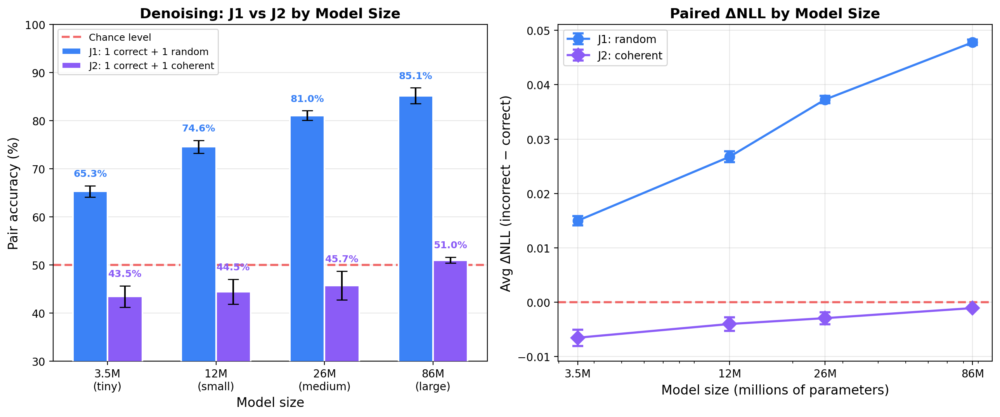
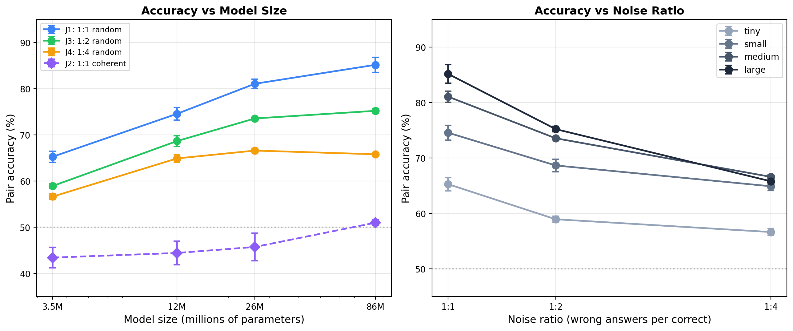
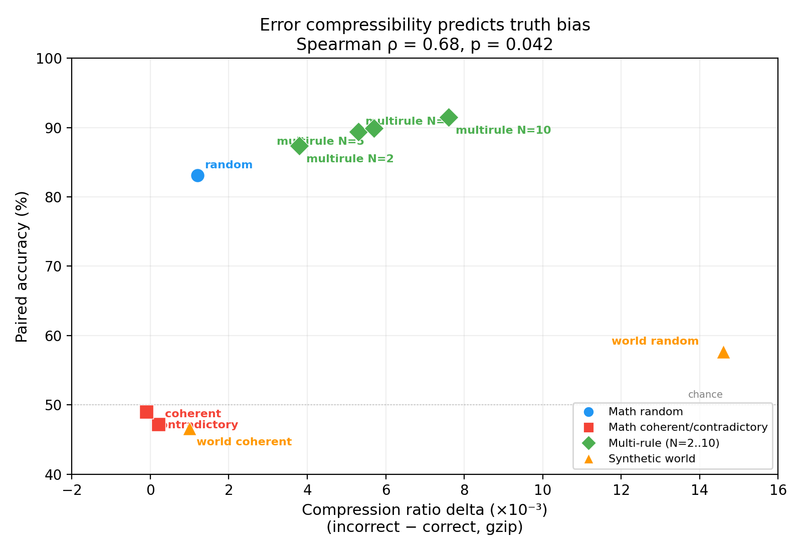
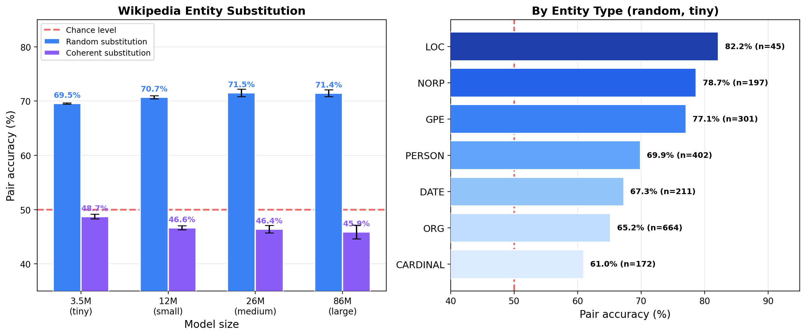
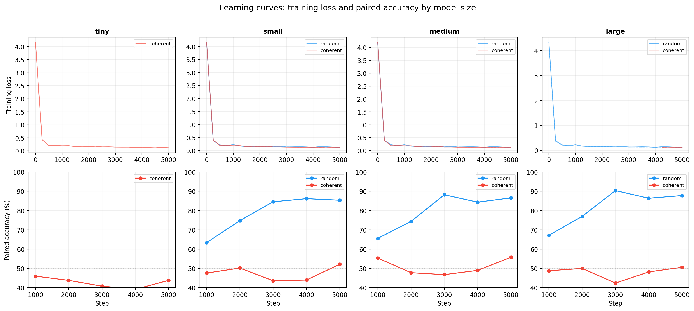

# Compression Favors Consistency, Not Truth: Signal Extraction and Error Structure in Language Model Training

**Author:** Konstantin Krestnikov
**Date:** 03.2026

## Abstract

When a language model trains on contradictory answers to the same question, which answer does it prefer? We propose the Compression--Consistency Principle: gradient descent favors the most compressible answer cluster, not truth per se. Truth bias emerges only when false alternatives fail to compress efficiently.

We test this with a denoising design: GPT-2 style transformers (3.5M--86M parameters) train on corpora where each mathematical problem appears with both correct and incorrect answers. With random errors, models extract the correct signal with increasing fidelity as capacity grows (65% pair accuracy at 3.5M, 85% at 86M). Replacing random errors with a coherent but wrong rule system eliminates the effect entirely (accuracy ~44--51% across all sizes). Increasing the noise ratio degrades signal extraction gracefully (1:2 noise: 75% at 86M; 1:4 noise: 66%, plateau).

Supporting experiments confirm the mechanism: the compression ratio gap between correct and incorrect completions predicts model behavior across 9 conditions (Spearman rho = 0.68, p = 0.042); multi-rule errors produce a graded curve from chance to 88% as rule diversity increases; and a real-text Wikipedia entity-substitution experiment reproduces the random/coherent contrast (71% vs 46%). The main implication: compression alone does not reliably favor truth over well-structured falsehood.

---

## 1. Introduction

Language models train on data that contains contradictions. The internet mixes correct and incorrect claims about the same facts, often in the same format and style. When a model compresses such a corpus, which version does it favor?

Several explanations have been proposed for why models sometimes prefer truth. Scaling helps: larger models perform better on factual tasks (Kadavath et al., 2022). RLHF steers models toward human-preferred outputs. Data statistics play a role: factual accuracy correlates with frequency and source reliability (Elazar et al., 2022; Joshi et al., 2024; Kandpal et al., 2023). Internal truth representations have been discovered in model activations (Burns et al., 2023; Marks & Tegmark, 2023). Yet none of these address a more fundamental question: *why would the training objective itself -- next-token prediction -- create any preference for truth?*

We propose that the answer lies in compression. Minimizing cross-entropy is equivalent to minimizing code length (Shannon, 1948; Deletang et al., 2024), connecting LLM training to the Minimum Description Length principle (Rissanen, 1978; Grunwald, 2007). A model that better predicts tokens is a better compressor. But compression does not inherently favor truth -- it favors the most *compressible* hypothesis consistent with the data.

We call this the **Compression--Consistency Principle**:

> Models do not privilege truth directly; they privilege the most compressible answer structure available in the data.

Truth benefits from compression only when falsehood is structurally incoherent. Diverse errors must be memorized individually, whereas a correct rule system compresses into a compact representation. When errors form a coherent alternative system -- internally consistent but wrong -- they compress just as efficiently, and the preference vanishes.

We test this with a **denoising design**: each mathematical problem appears in the training corpus with multiple contradictory answers. This directly models the scenario of conflicting information about the same fact. Five conditions vary the structure and ratio of contradictory answers (Section 3). Supporting experiments establish the compression mechanism (Section 5), demonstrate transfer to real Wikipedia text (Section 6), and explore boundary conditions including verification dependencies (Section 7).

Three caveats apply throughout. First, models compress *text*, not reality: "truth" here means correctness of mathematical derivations and factual accuracy of Wikipedia paragraphs. Second, frequency can override compressibility -- when errors dominate sufficiently, the model follows the majority. Third, the compressibility gap is corpus-dependent: in natural language, the gap is smaller than in formal math.

The work makes five contributions:

1. A **denoising experimental design** where the same problem appears with contradictory answers, directly testing signal extraction from noise.
2. The **random/coherent contrast** as the central finding: random errors yield strong truth bias that scales with model capacity; coherent errors yield none.
3. A **noise tolerance curve** showing graceful degradation as the signal-to-noise ratio decreases, with capacity-dependent plateaus.
4. **Quantitative validation**: the compression ratio gap measured by gzip predicts model behavior across 9 conditions (Spearman rho = 0.68, p = 0.042).
5. **Transfer to real text**: a Wikipedia entity-substitution experiment reproduces the same random/coherent contrast on natural language.

## 2. Related Work

### Prediction as Compression

The link between prediction and compression traces back to Shannon (1948), who showed that optimal compression requires knowledge of the true data distribution. Solomonoff (1964) formalized optimal prediction as weighting hypotheses by program length. Rissanen (1978) developed the Minimum Description Length (MDL) principle: the best model minimizes total description length. Grunwald (2007) systematized MDL and showed its equivalence to several forms of inference. Hutter (2005) developed these ideas into a formal theory of universal intelligence (AIXI), linking intelligence to compression.

In the context of language models, Deletang et al. (2024) showed that LLMs are universal compressors. Huang et al. (2024) discovered a linear correlation (r ~ -0.95) between compression quality and benchmark performance. Wan & Mei (2025) proved that LLM training approximates Solomonoff induction. Pan et al. (2025) used compression-based analysis to explain knowledge acquisition and scaling. Our work builds directly on the MDL framework: we experimentally vary the description length of false answer systems and observe under what conditions the MDL-optimal choice coincides with truth.

### Internal Representations of Truth in LLMs

Several studies have found internal representations correlated with truthfulness. Marks & Tegmark (2023) showed a linear geometric structure of truthfulness in activation space. Burns et al. (2023) proposed CCS for discovering truth directions without supervision. Li et al. (2023b) identified a gap between internal knowledge and generation. Ravfogel et al. (2025) proposed the Truth Co-occurrence Hypothesis. Azaria & Mitchell (2023) showed that internal states can distinguish true from false outputs. Burger et al. (2024) demonstrated robust cross-model lie detection. Halawi et al. (2024) found that larger models can "overthink" and revert to memorized facts. Ortu et al. (2024) traced competition between factual recall and counterfactual signals. Our work complements these at the behavioral level: we study when compression produces a preference for correct completions, leaving activation-level analysis for future work.

### Emergent World Models

Language models can form internal world models from pure text prediction. Li et al. (2023a) found that a model trained on Othello moves learns a board representation. Gurnee & Tegmark (2024) discovered linear representations of space and time in Llama-2. These show that compression can give rise to structured representations. Our work asks when compression yields behavioral preference for correct versus incorrect completions.

### Truthfulness and Training Data Statistics

Joshi et al. (2024) showed that truthfulness links to "personas" in pretraining data. Elazar et al. (2022) demonstrated dependence on fact frequency. Kandpal et al. (2023) showed a direct relationship between supporting documents and accuracy. Kalai & Vempala (2024) proved that calibrated models must hallucinate at a rate tied to the corpus's monofact rate. Our work differs: we *experimentally vary* error structure while controlling frequency, isolating compressibility as a factor beyond frequency and source reliability.

### Simplicity Bias, Noisy Labels, and Grokking

Neural networks prefer simple functions (Valle-Perez et al., 2019; Mingard et al., 2021; Goldblum et al., 2024; Bhattamishra et al., 2023). Mesaros et al. (2024) showed that models generalize compositionally when rules are simple. The noisy labels literature directly parallels our setup: Zhang et al. (2017) showed that networks can memorize random labels but generalize through structure; Rolnick et al. (2017) showed robustness to massive label noise. Our denoising result with random errors aligns with these observations. Grokking (Nanda et al., 2023; DeMoss et al., 2024; Liu et al., 2023) also connects to compression: the transition from memorization to generalization is a compression process. Our experiments with coherent errors show that a coherent false system is just as "simple" as truth, and compression shows no preference.

### Our Contribution

The works above study internal representations, establish theoretical links between compression and intelligence, or analyze dependence on data statistics. To our knowledge, direct training experiments with systematic variation of *error compressibility* in a *denoising* setting -- where contradictory answers coexist for the same problem -- remain limited. This work contributes such a controlled study. Unlike frequency-based analyses, we fix frequency and vary error structure. Unlike representational studies, we train from scratch and identify behavioral conditions for preference. Unlike noisy-label work, we show that "structured noise" (coherent errors) is not filtered out. The denoising design adds a dimension absent from our own prior work: within-problem contradiction rather than across-corpus mixing.

## 3. Methodology

### 3.1 Model and Training

GPT-2 style decoder-only transformers with pre-norm (LayerNorm before attention/MLP), GELU activation, and causal mask.

| Config | Layers | d_model | Heads | Parameters |
|--------|--------|---------|-------|------------|
| tiny | 4 | 256 | 4 | ~3.5M |
| small | 6 | 384 | 6 | ~12M |
| medium | 8 | 512 | 8 | ~26M |
| large | 12 | 768 | 12 | ~86M |

Denoising experiments (Section 4) use a PyTorch implementation; standard and Wikipedia experiments (Sections 5--6) use an MLX implementation. Exact parameter counts vary slightly by tokenizer and framework (within 10%). Optimizer: AdamW (weight_decay=0.01), cosine decay with linear warmup, lr=3e-4, seq_len=256, batch_size=32, 5000 steps. All experiments are repeated with multiple random initializations (4 seeds for core conditions, 2 seeds where noted).

### 3.2 Denoising Corpus Design

The denoising setup is the primary experimental paradigm. The generator creates mathematical problems of four types: multi-step arithmetic, factorization, equation solving, and differentiation. Each problem is formatted as a step-by-step derivation in English, verified by SymPy. The tokenizer is character-level (vocab ~57).

The key design feature: **each problem appears multiple times in the corpus with contradictory answers.** This directly models the internet scenario where the same question receives conflicting responses.

**Example (J1, random errors):**
```
Problem: Simplify 2 * (x + 3)
Correct:  2 * (x + 3) = 2x + 6           [appears once]
Wrong:    2 * (x + 3) = 2x + 5           [appears once, random error]
```

**Example (J2, coherent errors):**
```
Problem: Simplify 2 * (x + 3)
Correct:  2 * (x + 3) = 2x + 6           [appears once]
Wrong:    2 * (x + 3) = 2 * (x + 2) = 2x + 4  [appears once, systematic rule: a*(b+c) = a*(b+c-1)]
```

Five conditions vary the structure and ratio of contradictory answers:

| Condition | Correct | Incorrect | Ratio | Purpose |
|-----------|:-------:|:---------:|:-----:|---------|
| **J1** | 1 | 1 random | 1:1 | Core: signal extraction from random noise |
| **J2** | 1 | 1 coherent | 1:1 | Control: coherent errors eliminate bias |
| **J3** | 1 | 2 random | 1:2 | Noise tolerance at moderate noise |
| **J4** | 1 | 4 random | 1:4 | Noise tolerance at high noise |
| **J5** | 0 | 2 random | 0:2 | Zero-signal baseline (Appendix E) |

J5 contains no correct answers: the model trains entirely on random wrong derivations. This tests whether structural regularities of correct math are detectable even when never explicitly presented. Results are exploratory and reported in Appendix E.

### 3.3 Standard Corpus Design

As a complementary paradigm, we also train models on standard corpora where each problem appears once with either a correct or incorrect solution. The two groups do not share prompts: correct problems and incorrect problems are different instances. This design was used in our prior work and provides a bridge to the mechanism experiments (Section 5).

**Error types:**
- **Random:** A unique plausible error injected at a random step (sign, coefficient, distributivity). Each error is different.
- **Coherent:** One systematic wrong rule per problem type (e.g., a * b = a * (b-1); sign preserved when moving terms; derivative drops the coefficient). All problems of one type fail identically.

### 3.4 Wikipedia Corpus Design

To test transfer beyond formal math, we construct a real-text corpus from Wikipedia articles. Using NER (spaCy), we identify named entities in Wikipedia paragraphs and create two corruption modes:

- **Random substitution:** Each entity is replaced with a random entity of the same type from a global pool (e.g., "Paris" -> "Kumamoto").
- **Coherent substitution:** A consistent mapping is applied across the entire corpus (e.g., every "France" -> "Japan", every "Paris" -> "Tokyo"), preserving internal consistency.

The corpus contains 20,000 paragraphs. Models are trained on a 50/50 mix of original and corrupted paragraphs. Evaluation uses paired NLL comparison on held-out paragraphs: original vs. corrupted continuation given a shared context prefix.

### 3.5 Evaluation Metrics

**Paired evaluation (primary metric).** For each problem, a shared prompt is generated along with two completions (correct and incorrect). NLL is computed only on completion tokens, conditioned on the shared prompt. Metrics: **pair accuracy** (fraction of pairs where the model assigns lower NLL to the correct completion; our primary metric), mean DLoss on completions, and Wilcoxon signed-rank test. Pair accuracy is equivalent to the Common Language Effect Size (CLES; McGraw & Wong, 1992).

As auxiliary robustness checks, we store total NLL and length-matched mean NLL over completion tokens. These preserve the main sign pattern in key conditions.

**Corpus-level evaluation (secondary diagnostic).** We report corpus-level DLoss = Loss(incorrect) - Loss(correct) as a secondary check. This metric is sensitive to text statistics confounds (Section 5.3) and should not be treated as the primary measure of truth bias.

**Statistical analysis.** For training variability we report seed-level dispersion. For paired evaluation, the one-sided Wilcoxon test quantifies uncertainty over held-out pairs within a single trained model. With thousands of pairs, p-values are inevitably minuscule; readers should focus on pair accuracy and seed-level dispersion rather than p-values.

### 3.6 MDL Heuristic Framing

We state a heuristic MDL interpretation (Rissanen, 1978; Grunwald, 2007). Consider a denoising corpus where each problem appears with a correct answer (theory $T_1$) and an alternative answer (theory $T_2$). An idealized MDL learner minimizes $L(M) + L(D|M)$.

**Heuristic predictions:**

1. **$K(T_2) \gg K(T_1)$ (random errors).** Each false answer requires independent encoding. The false system's description length grows with corpus size. An MDL learner should favor $T_1$.

2. **$K(T_2) \approx K(T_1)$ (coherent errors).** Both systems are described by compact rules of comparable complexity. At equal frequency, an MDL learner has no reason to prefer one over the other.

3. **Increasing noise ratio.** As the number of random false answers per problem grows (J3, J4), the correct signal becomes a smaller fraction, but each individual false answer remains unique, preserving the compressibility advantage of truth -- up to a capacity-dependent limit.

The denoising experiments directly test these predictions.

---

## 4. Core Results: Signal Extraction from Contradictory Data

### 4.1 J1 vs J2: The Central Contrast

**Table 1.** Denoising paired evaluation: J1 (1 correct + 1 random) vs J2 (1 correct + 1 coherent), across model sizes.

| Size | Params | J1 Accuracy | J1 DLoss | J2 Accuracy | J2 DLoss | J1 Seeds | J2 Seeds |
|------|--------|:-----------:|:--------:|:-----------:|:--------:|:--------:|:--------:|
| tiny | 3.5M | **65.3% +/- 1.3%** | +0.015 | 43.5% +/- 2.6% | -0.007 | 4 | 4 |
| small | 12M | **74.6% +/- 1.6%** | +0.027 | 44.5% +/- 3.0% | -0.004 | 4 | 4 |
| medium | 26M | **81.1% +/- 1.2%** | +0.037 | 45.8% +/- 3.4% | -0.003 | 4 | 4 |
| large | 86M | **85.2% +/- 2.3%** | +0.048 | 51.0% +/- 0.8% | -0.001 | 2 | 2 |



*Figure 2. The central contrast. J1 (random errors): accuracy scales monotonically from 65% to 85%. J2 (coherent errors): accuracy stays near chance (44--51%) across all sizes. The gap between the curves is the compression-consistency effect.*

This is the central result of the paper. When the same problem appears with both a correct and a random wrong answer, the model progressively learns to prefer the correct one. At 86M parameters, accuracy reaches 85%. When the wrong answer follows a coherent rule system, the effect disappears entirely -- accuracy converges to 50% from below.

**Scaling.** J1 accuracy increases monotonically: 65% -> 75% -> 81% -> 85%. The largest gain is between tiny and small (+9 pp), with continued growth through large. J2 accuracy converges toward 50% as models grow, consistent with the MDL prediction that equal-description-length systems at equal frequency should be indistinguishable.

**Below-chance accuracy at small scale (J2).** The tiny model's J2 accuracy of 43.5% is consistently below 50%, replicating a pattern seen across multiple independent setups: standard coherent (47.2%), BPE coherent (45.9%), synthetic world coherent (46.6%). This reflects textual simplicity asymmetry: the coherent error rules used here produce shorter or simpler outputs than the true rules (e.g., dropping a coefficient in derivatives, multiplying by b-1 instead of b). As capacity grows, the model represents both systems with equal per-token accuracy, and the asymmetry disappears.

This below-chance pattern is not a confound -- it is additional evidence for the thesis. A potential concern is that the coherent condition conflates "systematic falseness" with "surface textual simplicity," and that the model prefers coherent errors not because they are equally compressible as a *system* but because they are locally simpler as *text*. The below-chance accuracy directly addresses this: when the false system happens to be textually simpler, the compressor *actively prefers it over truth*. This is exactly what the Compression--Consistency Principle predicts. The compressor has no concept of correctness; it follows whichever signal is easier to encode. When coherent errors are simpler, they win; when they are matched in complexity, the result is chance; truth never receives preferential treatment. The convergence to 50% at larger model sizes further confirms that the asymmetry is surface-level: once the model has enough capacity to represent both systems equally well, neither is preferred.

### 4.2 J3 and J4: Noise Tolerance

What happens when the noise ratio increases? J3 adds two random wrong answers per problem (1:2 ratio); J4 adds four (1:4 ratio).

**Table 2.** Noise tolerance: paired accuracy across denoising conditions.

| Condition | Ratio | Tiny | Small | Medium | Large | Seeds |
|-----------|:-----:|:----:|:-----:|:------:|:-----:|:-----:|
| J1 | 1:1 | 65.3% | 74.6% | 81.1% | 85.2% | 4/4/4/2 |
| J3 | 1:2 | 59.0% | 68.6% | 73.6% | 75.2% | 2/2/2/2 |
| J4 | 1:4 | 56.6% | 64.9% | 66.6% | 65.8% | 2/2/2/2 |
| J2 | 1:1 coh. | 43.5% | 44.5% | 45.8% | 51.0% | 4/4/4/2 |



*Figure 3. Noise tolerance. Left: accuracy vs model size for J1/J3/J4. Higher noise ratios yield lower accuracy and earlier plateaus. Right: accuracy vs noise ratio at each model size, showing graceful degradation.*

Three observations:

1. **Graceful degradation.** Increasing the noise ratio reduces accuracy but does not destroy the signal. At 1:4 noise (J4), even the tiny model extracts a weak signal (56.6%), and the small model reaches 65%.

2. **Capacity-dependent plateaus.** J4 accuracy plateaus at medium/large: 66.6% -> 65.8%. The signal-to-noise ratio becomes the bottleneck -- additional capacity cannot overcome 4:1 noise. J3 still shows growth at large (75.2%), though slower than J1. J1 shows no plateau in the tested range.

3. **Signal-to-noise logic.** The results follow a clean signal-to-noise logic: for each noise ratio, there exists a model capacity at which accuracy saturates. Lower ratios saturate at higher accuracy. This is consistent with the MDL framing: as the number of unique wrong answers grows, the compressibility advantage of the correct cluster persists but must compete with sheer volume of noise.

### 4.3 Comparison with the Standard (Non-Denoising) Setup

In the standard setup, different problems receive correct or incorrect solutions -- no problem appears with both. How does this compare to the denoising design?

**Table 4.** Standard vs denoising accuracy (50/50 random errors).

| Size | Standard | Denoising (J1) | Gap |
|------|:--------:|:--------------:|:---:|
| tiny | 83.1% | 65.3% | -17.8 pp |
| small | 88.4% | 74.6% | -13.8 pp |
| medium | 88.4% | 81.1% | -7.3 pp |
| large | 89.1% | 85.2% | -3.9 pp |

The denoising setup is substantially harder: within-problem contradiction is more challenging than across-corpus mixing. However, the gap closes with scale: 18 pp at tiny, 4 pp at large. The same model that achieves 85% on denoising at 86M would presumably match or exceed the standard setup's 89% with further scaling. Both setups show the same qualitative pattern -- truth bias that scales with model capacity -- confirming that the underlying mechanism is the same.

---

## 5. Mechanistic Evidence

The denoising results show *what* happens. This section explains *why*, using three complementary approaches: a direct compressibility measurement, a multi-rule gradient experiment, and the standard paired baselines that bridge to the denoising findings.

### 5.1 Compressibility Predicts Truth Bias

To operationalize the MDL argument, we measure the compression ratio of correct vs incorrect completion segments using gzip (level 9) on concatenated completions from each paired test set (thousands of completions per condition). The compression ratio delta provides a model-free proxy for the compressibility gap.

**Table 5.** Compression ratio (gzip) and paired accuracy across conditions.

| Condition | Correct | Incorrect | Delta | Paired Accuracy |
|-----------|:-------:|:---------:|:-----:|:--------------:|
| random 50/50 | 0.1627 | 0.1639 | +0.0012 | 83.1% |
| coherent 50/50 | 0.1656 | 0.1658 | +0.0002 | 47.2% |
| contradictory | 0.1745 | 0.1744 | -0.0001 | 49.0% |
| multirule N=2 | 0.1671 | 0.1710 | +0.0038 | 77.6% |
| multirule N=3 | 0.1669 | 0.1722 | +0.0053 | 82.8% |
| multirule N=5 | 0.1672 | 0.1730 | +0.0057 | 84.8% |
| multirule N=10 | 0.1676 | 0.1752 | +0.0076 | 88.3% |
| world random | 0.0370 | 0.0516 | +0.0146 | 57.7% |
| world coherent | 0.0374 | 0.0384 | +0.0010 | 46.6% |



*Figure 4. Compression ratio delta (gzip, incorrect minus correct) vs paired accuracy. Spearman rho = 0.68, p = 0.042. Coherent and contradictory errors cluster near zero delta and chance accuracy; random and multi-rule errors show progressively larger deltas.*

The rank correlation is significant (Spearman rho = 0.68, p = 0.042), confirming that the compressibility gap -- measurable by a generic compressor without any trained model -- predicts whether gradient-descent-trained models exhibit truth bias. Within the math domain, the multi-rule series is monotonic: larger compression deltas map to higher accuracy. The Pearson correlation is lower (r = 0.27) because the synthetic world is an outlier (large delta, modest accuracy), likely because the tiny model extracts less structure from natural language than from formal math.

### 5.2 Multi-Rule Errors: Graded Restoration

The denoising experiment establishes two poles: coherent errors (one rule) yield chance, random errors yield strong bias. Multi-rule errors test the continuum. For each task type, a pool of N alternative wrong rules is created; for each problem, one rule is chosen at random. Each rule is compact, but the mapping "problem -> rule" is unpredictable.

**Table 6.** Matched paired evaluation of multi-rule errors (tiny, 3.5M, 50/50, 4 seeds).

| N Rules | Accuracy | DLoss (paired) | Wilcoxon p |
|:-------:|:--------:|:--------------:|:----------:|
| 1 (coherent) | 46.6% | -0.0019 | ~1.0 |
| 2 | 77.6% | +0.0152 | < 10^-6 |
| 3 | 82.8% | +0.0213 | < 10^-6 |
| 5 | 84.8% | +0.0293 | < 10^-6 |
| 10 | 88.3% | +0.0440 | < 10^-6 |


*Figure 5. Matched paired evaluation for multi-rule errors. The curve is steepest between N=1 and N=2 (phase transition from coherent to diverse), then continues growing gradually.*

The largest increase is between one rule and two rules (47% -> 78%), but the curve remains graded afterward. This matches the compression measurement: adding a second rule destroys the false system's compressibility advantage; additional rules further erode it. The critical observation is that a single coherent alternative rule suffices to eliminate truth bias entirely, while even two alternatives restore most of it.

### 5.3 Standard Paired Baselines

The standard (non-denoising) experiments serve as a bridge: they show the same random/coherent contrast in a simpler design.

**Table 7.** Standard paired evaluation at 50/50 (tiny, 4 seeds).

| Error Type | Pair Accuracy | DLoss (paired) | Wilcoxon p |
|------------|:------------:|:--------------:|:----------:|
| Random | **83.1%** | +0.048 | < 10^-6 |
| Contradictory | 49.0% | +0.0003 | > 0.3 |
| Coherent | 47.2% | -0.0018 | ~1.0 |

The pattern replicates across proportions:

**Table 7a.** Standard paired evaluation across proportions (random errors, 4 seeds).

| Proportion | Pair Accuracy | DLoss (paired) |
|:----------:|:------------:|:--------------:|
| 50/50 | 83% | +0.048 |
| 40/60 | 79% | +0.043 |
| 30/70 | 75% | +0.036 |
| 20/80 | 69% | +0.029 |
| 10/90 | 67% | +0.017 |

Even at 10/90, where correct examples are outnumbered 9:1, paired accuracy remains 67% (p < 10^-88). Truth bias persists under extreme frequency imbalance because the structural incompressibility of random errors provides a compression-based advantage that frequency alone cannot eliminate.

For coherent errors, the picture inverts: the model follows pure frequency, preferring whichever system is more abundant. At 20/80 coherent, accuracy drops to 9.6% -- the model actively prefers the false system in 91% of pairs.

**Table 7b.** Random vs coherent paired accuracy across proportions.

| Proportion | Random Accuracy | Coherent Accuracy |
|:----------:|:--------------:|:-----------------:|
| 50/50 | 83% | 47.2% |
| 40/60 | 79% | 27.8% |
| 30/70 | 75% | 14.7% |
| 20/80 | 69% | 9.6% |

**Scaling in the standard setup.** The standard random/coherent contrast scales across the full size range:

**Table 7c.** Standard paired accuracy by model size (50/50, 4 seeds).

| Size | Random Accuracy | Coherent Accuracy |
|------|:--------------:|:-----------------:|
| tiny (3.5M) | 83.1% | 47.2% |
| small (12M) | 88.4% | 49.6% |
| medium (26M) | 88.4% | 52.6% |
| large (86M) | 89.1% | 51.4% |


*Figure 6. Scaling in the standard setup. Random accuracy rises from 83% to 89%; coherent accuracy stays near chance (47--53%) across the 3.5M--86M range.*

**Why corpus-level metrics mislead.** Corpus-level DLoss can systematically overestimate truth bias. At standard 10/90, corpus-level DLoss inverts (-0.0016) while paired accuracy remains 67%. For observation/correction conditions (not shown in main text; see Appendix B), corpus-level DLoss is positive but paired accuracy is ~49%. The per-pair NLL difference distribution reveals why: for random errors, it is right-skewed with a heavy tail; for coherent errors, it is symmetric around zero. Paired evaluation is necessary for reliable measurement.

### 5.4 Synthesis: The Mechanism

The three lines of evidence converge:

1. **Random errors are incompressible.** Each random error is unique; the false cluster cannot compress into a compact rule. The correct cluster has lower description length, and the model preferentially encodes it.

2. **Coherent errors are equally compressible.** One systematic wrong rule is as compact as one correct rule. Compression provides no basis to prefer truth.

3. **Rule diversity is the key variable.** Increasing the number of false rules from 1 to 10 progressively degrades the compressibility of the false cluster, producing a graded curve from chance to 88% that tracks the gzip compression delta (rho = 0.68).

The denoising results (Section 4) add a dimension: even when contradictory answers coexist for the same problem, the same mechanism applies. The model extracts the compressible signal from noise.

---

## 6. Transfer Beyond Mathematics

Mathematics has an unusually crisp correct/incorrect distinction. Does the principle transfer to domains with more textual flexibility?

### 6.1 Wikipedia Entity Substitution

We train models on Wikipedia paragraphs where entities have been substituted (Section 3.4). Paired evaluation compares original paragraphs against corrupted versions given a shared context prefix.

**Table 8.** Wikipedia entity substitution (50/50, 4 seeds per size).

| Size | Random Accuracy | Random DLoss | Coherent Accuracy | Coherent DLoss |
|------|:--------------:|:------------:|:-----------------:|:--------------:|
| tiny (3.5M) | **69.6% +/- 0.1%** | +0.064 | 48.7% +/- 0.5% | +0.000 |
| small (12M) | **70.7% +/- 0.4%** | +0.065 | 46.6% +/- 0.4% | -0.002 |
| medium (26M) | **71.5% +/- 0.8%** | +0.068 | 46.4% +/- 0.8% | -0.003 |
| large (86M) | **71.4% +/- 0.7%** | +0.069 | 45.9% +/- 1.5% | -0.005 |



*Figure 7. Wikipedia entity substitution. Left: random accuracy is 70--71% across all sizes, well above chance. Coherent accuracy is at or below chance (46--49%). Right: per-entity-type accuracy for random errors (tiny, seed 42).*

The random/coherent contrast reproduces on real text:

1. **Truth bias reproduces.** Random substitution yields 70--71% accuracy across all sizes (all seeds p < 10^-100). The model distinguishes original Wikipedia paragraphs from randomly corrupted ones.

2. **Coherent substitution eliminates the effect.** Coherent substitution yields 46--49% accuracy -- at or below chance. When substitution is internally consistent (every "France" -> "Japan", every "Paris" -> "Tokyo"), the model cannot distinguish original from corrupted text.

3. **The effect is weaker than in math.** Wikipedia random accuracy (71%) is substantially below math standard (83%) and math denoising J1 (65--85%). Natural language provides more textual flexibility, allowing corrupted text to remain locally fluent.

4. **Scaling is flat.** Unlike math, where accuracy grows from 65--83% at tiny to 85--89% at large, Wikipedia accuracy saturates near 70% across the tested size range. This suggests that the compressibility gap in natural language is smaller and does not substantially benefit from additional model capacity in the 3.5M--86M range.

**Per-entity-type accuracy** (random, tiny):

| Entity Type | N Pairs | Accuracy |
|-------------|:-------:|:--------:|
| LOC | 45 | 82.2% |
| NORP | 197 | 78.7% |
| GPE | 301 | 77.1% |
| PERSON | 402 | 69.9% |
| DATE | 211 | 67.3% |
| ORG | 664 | 65.2% |
| CARDINAL | 172 | 61.0% |

Geographic entities (GPE, LOC, NORP) show the strongest effect (77--82%), likely because location names create strong contextual expectations. Organization and person names are more interchangeable. Cardinal numbers are weakest (61%), consistent with their high variability in natural text.

**Coherent substitution: below-chance trend.** Coherent accuracy trends slightly below 50% and continues to decrease at larger model sizes (48.7% -> 45.9%). This mirrors the math result: when the coherent false system is textually simpler or more uniform than the original, the model slightly prefers it. This reinforces the thesis: the compressor prefers whatever is easier to encode.

### 6.2 Synthetic World (Brief)

As an additional controlled natural-language test, we construct a synthetic world with 50 entities, 4 types (animals, plants, minerals, potions), and 15 deterministic rules. Random errors yield 57.7% accuracy; coherent errors yield 46.6%. The pattern replicates, though the effect is weaker than Wikipedia (57.7% vs 70%) due to the more constrained vocabulary and simpler rule structure. Multi-alternative errors in the synthetic world show a gradual rise from 47% to 60% (N=1 to N=16), much slower than the steep N=1->N=2 jump in math (47% to 78%). Natural language absorbs contradictions that formal math cannot: phrases like "has thin scales" and "has dense armor plates" are both easily compressible as textual patterns, unlike contradictory arithmetic rules. Full results are in Appendix C.

---

## 7. Boundary Conditions and Robustness

### 7.1 Chained Verification

If coherent errors cannot be distinguished from truth under compression alone, can embedding verification dependencies help? We construct *chained tasks* where a computation using the coherent false rule is accompanied by arithmetic verification: for correct solutions, verification confirms the result (residual = 0); for coherent-error solutions, it produces an unpredictable numerical residual.

Six chain types: arithmetic -> reverse, factoring -> evaluation, linear equation -> back-substitution, quadratic -> root substitution, derivative -> finite difference, tangent -> prediction.

**Table 9.** Chained tasks (50/50, coherent errors with verification).

| Size | Chained Accuracy | Standard Coherent | Improvement |
|------|:----------------:|:-----------------:|:-----------:|
| tiny (3.5M) | **70.9% +/- 1.2%** | 43.3% | +27.6 pp |
| small (12M) | 64.2% +/- 1.5% | 49.6% | +14.6 pp |
| large (86M) | 60.6% +/- 1.2% | 51.4% | +9.2 pp |


*Figure 8. Chained verification restores truth bias from 43% to 71% at tiny, but the effect weakens at larger model sizes. Control: truncated chains without verification yield 44.3% -- same as standard coherent.*

Key observations:

1. **Verification restores truth bias.** Chained accuracy of 70.9% is well above chance and above standard coherent errors (43.3%). Verification transforms the coherent error's predictable residual into an unpredictable one, breaking its compressibility advantage.

2. **The effect declines with model size.** Unlike random errors (83% -> 89%), chained accuracy decreases: 71% -> 64% -> 61%. A plausible explanation: higher-capacity models learn the coherent within-domain pattern more readily than the weaker verification signal. This is preliminary (2 seeds at large) and should not be treated as an established inverse-scaling law.

3. **Accuracy varies by chain type.** Arithmetic reverse: 95.8% (strongest -- incorrect multiplication yields a fractional result on reverse). Tangent prediction: 34.8% (below chance -- O(h^2) approximation error masks the coherent rule error).

4. **Verification is the active ingredient.** Truncated chains (same tasks, no verification step) yield 44.3% -- indistinguishable from standard coherent (43.3%).

### 7.2 BPE Tokenization

To rule out character-level encoding artifacts, we repeat the key comparison with a SentencePiece BPE tokenizer (vocab 1000).

**Table 10.** BPE vs char-level paired accuracy (tiny, 4 seeds).

| Tokenizer | Random 50/50 | Coherent 50/50 |
|-----------|:------------:|:--------------:|
| Char (vocab 57) | 83.1% +/- 2.0% | 47.2% +/- 2.7% |
| BPE (vocab 1000) | **85.6% +/- 0.2%** | **45.9% +/- 1.4%** |

The effect survives BPE and is marginally stronger (85.6% vs 83.1%), with lower cross-seed variance. This rules out the concern that character-level encoding makes errors trivially detectable.

### 7.3 Generation Sanity Check

Paired evaluation is a forced-choice setting. To verify that the effect extends to generation, we run greedy decoding on 500 test prompts per model with automated SymPy verification.

**Table 11.** Generative accuracy (tiny, 4 seeds, 500 problems each).

| Condition | Mean Accuracy | p (paired t-test) |
|-----------|:------------:|:-----------------:|
| Random-trained | 30.5% +/- 1.7% | 0.013 |
| Coherent-trained | 20.8% +/- 3.6% | -- |

Random-trained models generate correct solutions 1.5x more often than coherent-trained ones. The generation gap is smaller than the paired gap (30% vs 21% generative, compared with 83% vs 47% discriminative), confirming that generation is harder. But the directional result holds: truth bias observed in paired evaluation reflects a genuine advantage in producing correct solutions.

### 7.4 Learning Curves

A potential confound in fixed-step scaling is differential convergence. We evaluate paired accuracy at intermediate checkpoints.



*Figure 9. Learning curves. All sizes reach behavioral plateau by step 3000--4000. The large model achieves 88.8% at step 3000, stable through 5000. Coherent models stay near chance throughout.*

All sizes reach a behavioral plateau by step 3000--4000. The large model is not substantially undertrained: its convergence precedes the training endpoint. Coherent-error models show no trend at any checkpoint (40--56% across all steps and sizes).

---

## 8. Discussion

### 8.1 The Compression--Consistency Principle

The experiments support a unified interpretation:

**Compression favors consistency, not truth.** Any internally consistent rule system -- true or false -- compresses equally well. Truth bias emerges only when false alternatives are structurally incoherent.

The evidence spans three experimental paradigms:

- **Denoising** (Section 4): within-problem contradiction. Random errors -> 65--85% accuracy, scaling with capacity. Coherent errors -> 44--51%, at chance.
- **Standard** (Section 5.3): across-corpus mixing. Same qualitative pattern: 83--89% random, 47--52% coherent.
- **Transfer** (Section 6): Wikipedia real text. 70--71% random, 46--49% coherent.

The mechanism is compression-based:
- The gzip compression delta predicts paired accuracy across 9 conditions (rho = 0.68, p = 0.042).
- Multi-rule errors produce a graded curve from chance to 88% as rule diversity increases.
- Noise tolerance follows a signal-to-noise logic with capacity-dependent plateaus.

### 8.2 Implications

**For alignment.** The training objective does not by itself provide a "truth compass." Systematic falsehood can remain competitive when internally coherent. Verification dependencies can help (43% -> 71%), but their effectiveness at scale remains an open question -- the observed declining trend (71% -> 61%) suggests that higher-capacity models may require denser verification networks.

**For understanding hallucinations.** Our results complement the statistical hallucination bound of Kalai & Vempala (2024): coherent misconceptions can remain attractive to the model because they compress well, independently of rarity. Whether this extends from synthetic corpora to real hallucination behavior requires direct empirical work.

**For data curation.** The denoising results have practical relevance for training data quality. When a corpus contains contradictory answers to the same question, models with sufficient capacity will tend to favor the more compressible cluster. This is good news when errors are diverse (as in naturally occurring mistakes), but concerning when errors are systematic (as in coordinated misinformation).

### 8.3 Analogy with Popper's Falsifiability

Our results admit an interpretive analogy with the falsifiability criterion (Popper, 1959). Compression pressure acts as a computational analog: a true theory with concrete predictions requires no additional explanations (maximal compression); a false theory whose predictions diverge from data needs correction (poor compression). However, the analogy has limits. First, the model does not "test" theories -- it minimizes code length. Second, regular discrepancies are compressible and do not function as falsifications for a compressor. Third, even ad hoc corrections do not produce transferable truth bias (Appendix B.2). For a compressor, a discrepancy is merely another pattern.

### 8.4 Limitations

**Model scale.** Experiments use models from 3.5M to 86M parameters. The denoising results show clear scaling trends but do not establish whether these continue beyond 86M. For coherent errors, there is a stronger heuristic argument: if both systems have comparable description length and equal frequency, an MDL learner has no basis to prefer one over the other regardless of scale.

**Domain specificity.** Mathematics has an unusually crisp correct/incorrect distinction. The effect weakens in natural language: 71% on Wikipedia, 58% in synthetic world, vs 83--89% in math. Natural language provides more degrees of freedom to encode contradictory information, reducing the compressibility gap.

**Seed counts.** Core denoising conditions (J1, J2) use 4 seeds at tiny/small/medium and 2 seeds at large. Noise tolerance conditions (J3, J4) use 2 seeds. This is sufficient to show directional stability but does not tightly estimate between-run variability for the 2-seed conditions.

**Denoising vs standard comparison.** The denoising and standard experiments use different implementations (PyTorch vs MLX) with slightly different parameter counts. While the qualitative comparison is valid, exact numerical differences should be interpreted with this caveat.

**Training duration.** All models train for 5000 steps with a fixed schedule. Learning curves show behavioral plateau by step 3000--4000 at all sizes, mitigating the concern about differential convergence. Compute-matched comparisons would further strengthen the conclusions.

**Discriminative scope.** The primary metric is paired evaluation (forced choice). Generation sanity checks confirm the direction (30.5% vs 20.8%) but the gap is smaller. The full relationship between discriminative truth bias and generative truthfulness remains an open question.

### 8.5 Future Work

Key open directions:

1. **Scale.** Extending denoising experiments beyond 86M parameters with compute-matched training budgets.
2. **Verification density.** Increasing cross-domain checks per task to test whether denser verification compensates for the compressor's growing power.
3. **Real-world domains.** Extending to domains with competing knowledge systems (e.g., historical scientific debates) where the correct/incorrect boundary is well-established.
4. **Denoising on real text.** A denoising-style experiment on Wikipedia (same paragraph, original vs corrupted completion) as a bridge between the math denoising core and the entity-substitution transfer evidence.
5. **Internal representations.** Linear probing for "truth directions" vs "coherence directions" (Marks & Tegmark, 2023) in models trained under our conditions.

---

## 9. Conclusion

In controlled experiments, compression favors consistency, not truth. When language models train on contradictory answers to the same mathematical problems, they prefer the correct answer only when errors are structurally incoherent -- accuracy scales from 65% (3.5M) to 85% (86M) for random errors, but stays near chance for coherent errors across all model sizes. The compression ratio gap between correct and incorrect completions, measurable by a generic compressor, predicts this behavior (rho = 0.68, p = 0.042). The same random/coherent contrast reproduces on real Wikipedia text (71% vs 46%) and in multi-rule experiments that show a graded curve from chance to 88%. Embedding verification steps can partially restore truth bias (43% -> 71%), but the effect weakens at larger sizes. The main implication: the training objective alone does not provide a reliable "truth compass" -- a compressor model is a consistency-seeking system, not a truth-seeking one. Truth wins only when it is the most compressible answer available.

---

## References

Azaria, A., & Mitchell, T. (2023). The Internal State of an LLM Knows When It's Lying. *Findings of EMNLP 2023*.

Bhattamishra, S., Patel, A., Kamath, S., & Blunsom, P. (2023). Simplicity Bias in Transformers and their Ability to Learn Sparse Boolean Functions. *ACL 2023*.

Burger, L., Hamprecht, F. A., & Nadler, B. (2024). Truth is Universal: Robust Detection of Lies in LLMs. *NeurIPS 2024*.

Burns, C., Ye, H., Klein, D., & Steinhardt, J. (2023). Discovering Latent Knowledge in Language Models Without Supervision. *ICLR 2023*.

Chlon, L., Karim, A., Chlon, M., & Awada, M. (2025). Predictable Compression Failures: Why Language Models Actually Hallucinate. *arXiv:2509.11208*.

Deletang, G., Ruoss, A., Grau-Moya, J., Genewein, T., Wenliang, L. K., Catt, E., ... & Legg, S. (2024). Language Modeling Is Compression. *ICLR 2024*.

DeMoss, B., Sapora, S., Foerster, J., Hawes, N., & Posner, I. (2024). The Complexity Dynamics of Grokking. *arXiv:2412.09810*.

Elazar, Y., Kassner, N., Ravfogel, S., Ravichander, A., Hovy, E., Schutze, H., & Goldberg, Y. (2022). Measuring Causal Effects of Data Statistics on Language Model's Factual Predictions. *arXiv:2207.14251*.

Goldblum, M., Finzi, M., Rowan, K., & Wilson, A. G. (2024). The No Free Lunch Theorem, Kolmogorov Complexity, and the Role of Inductive Biases in Machine Learning. *ICML 2024*.

Grunwald, P. D. (2007). The Minimum Description Length Principle. *MIT Press*.

Gurnee, W., & Tegmark, M. (2024). Language Models Represent Space and Time. *ICLR 2024*.

Halawi, D., Denain, J.-S., & Steinhardt, J. (2024). Overthinking the Truth: Understanding how Language Models Process False Demonstrations. *ICLR 2024*.

Huang, Y., Zhang, J., Shan, Z., & He, J. (2024). Compression Represents Intelligence Linearly. *COLM 2024*.

Hutter, M. (2005). Universal Artificial Intelligence: Sequential Decisions Based on Algorithmic Probability. *Springer*.

Joshi, N., Rando, J., Saparov, A., Kim, N., & He, H. (2024). Personas as a Way to Model Truthfulness in Language Models. *EMNLP 2024*.

Kadavath, S., Conerly, T., Askell, A., Henighan, T., Drain, D., Perez, E., ... & Kaplan, J. (2022). Language Models (Mostly) Know What They Know. *arXiv:2207.05221*.

Kalai, A. T., & Vempala, S. S. (2024). Calibrated Language Models Must Hallucinate. *STOC 2024*.

Kandpal, N., Deng, H., Roberts, A., Wallace, E., & Raffel, C. (2023). Large Language Models Struggle to Learn Long-Tail Knowledge. *ICML 2023*.

Kang, J., & Choi, J. (2023). Impact of Co-occurrence on Factual Knowledge of Large Language Models. *Findings of EMNLP 2023*.

Li, K., Hopkins, A. K., Bau, D., Viegas, F., Pfister, H., & Wattenberg, M. (2023a). Emergent World Representations: Exploring a Sequence Model Trained on a Synthetic Task. *ICLR 2023*.

Li, K., Patel, O., Viegas, F., Pfister, H., & Wattenberg, M. (2023b). Inference-Time Intervention: Eliciting Truthful Answers from a Language Model. *NeurIPS 2023*.

Liu, Z., Zhong, Z., & Tegmark, M. (2023). Grokking as Compression: A Nonlinear Complexity Perspective. *arXiv:2310.05918*.

Marks, S., & Tegmark, M. (2023). The Geometry of Truth: Emergent Linear Structure in Large Language Model Representations of True/False Datasets. *arXiv:2310.06824*.

McGraw, K. O., & Wong, S. P. (1992). A Common Language Effect Size Statistic. *Psychological Bulletin*, 111(2), 361-365.

Mesaros, A., Grau-Moya, J., Orseau, L., & Deletang, G. (2024). Rule Extrapolation in Language Models: A Study of Compositional Generalization on OOD Prompts. *NeurIPS 2024*.

Mingard, C., Valle-Perez, G., Sherrington, D., & Louis, A. A. (2021). Is SGD a Bayesian Sampler? Well, Almost. *JMLR 2021*.

Nanda, N., Chan, L., Lieberum, T., Smith, J., & Steinhardt, J. (2023). Progress Measures for Grokking via Mechanistic Interpretability. *ICLR 2023*.

Ortu, F., Jin, Z., Doimo, D., Sachan, M., & Yun, C. (2024). Competition of Mechanisms: Tracing How Language Models Handle Facts and Counterfactuals. *ACL 2024*.

Pan, Z., Wang, S., & Li, J. (2025). Understanding LLM Behaviors via Compression: Data Generation, Knowledge Acquisition and Scaling Laws. *arXiv:2504.09597*.

Popper, K. (1959). The Logic of Scientific Discovery. *Hutchinson*.

Ravfogel, S., Yehudai, G., Linzen, T., Bietti, A., & Bruna, J. (2025). Emergence of Linear Truth Encodings in Language Models. *NeurIPS 2025*.

Rissanen, J. (1978). Modeling by Shortest Data Description. *Automatica*, 14(5), 465-471.

Rolnick, D., Veit, A., Belongie, S., & Shavit, N. (2017). Deep Learning is Robust to Massive Label Noise. *arXiv:1705.10694*.

Shannon, C. E. (1948). A Mathematical Theory of Communication. *Bell System Technical Journal*, 27(3), 379-423.

Solomonoff, R. J. (1964). A Formal Theory of Inductive Inference. *Information and Control*, 7(1), 1-22.

Valle-Perez, G., Camargo, C. Q., & Louis, A. A. (2019). Deep Learning Generalizes Because the Parameter-Function Map Is Biased Towards Simple Functions. *ICLR 2019*.

Wan, J., & Mei, L. (2025). Large Language Models as Computable Approximations to Solomonoff Induction. *arXiv:2505.15784*.

Zhang, C., Bengio, S., Hardt, M., Recht, B., & Vinyals, O. (2017). Understanding Deep Learning Requires Rethinking Generalization. *ICLR 2017*.

---

## Appendix A: Reproducibility

All code, data generation scripts, and evaluation scripts are available at https://github.com/Rai220/compression-drives-truth. Denoising experiments (Experiment J) were run on Modal.com T4 GPUs using PyTorch. Standard math experiments and Wikipedia experiments were run on an Apple Mac M4 with 36GB unified memory using the MLX framework (v0.31.0). Total computational cost: approximately 80 hours across all experiments.

---

## Appendix B: Standard Experiment Details

### B.1 Corpus-Level Evaluation and Its Limitations

In the standard setup, corpus-level DLoss = Loss(incorrect) - Loss(correct) provides a coarse measure. At 50/50 random, corpus-level DLoss = +0.0115 (4/4 seeds favor correct). The effect decreases monotonically with the fraction of correct data: +0.0089 (40/60), +0.0064 (30/70), +0.0033 (20/80), -0.0016 (10/90). The inversion at 10/90 is a frequency artifact: paired evaluation shows continued truth bias (67%).

### B.2 Observations and Ad Hoc Correction (Experiments 2--3)

We tested whether adding empirical feedback (observations showing discrepancies between false theory predictions and reality) restores truth bias for coherent errors.

**Observations (Experiment 2).** Adding 10--50% observation checks to the coherent 50/50 corpus yields DLoss = +0.0002 to +0.0008 -- an order of magnitude weaker than random errors. Regular discrepancies (the a*b = a*(b-1) rule always understates by a) are themselves compressible.

**Five conditions for the false theory (Experiment 3).** Conditions A (no observations), B (bare discrepancies), C (ad hoc correction), D (systematic correction), E (non-specific predictions). Corpus-level DLoss ordering: D ~ C > E > B ~ A. However, **paired evaluation shows no truth bias for any condition** (accuracy ~49% for all). The corpus-level effect is an artifact of text statistics differences between correct and incorrect corpora.

This result demonstrates the critical importance of paired evaluation.

### B.3 NLL Distribution Analysis

The per-pair NLL difference distribution explains metric divergence:
- **Random errors:** right-skewed, mean = +0.048, median = +0.025, 81.5% positive, heavy tail to +0.4.
- **Coherent errors:** symmetric around zero, 45.5% positive.

The skew explains why pair accuracy and mean DLoss can diverge: a minority of pairs with extreme DLoss can pull the mean without affecting the median or the accuracy count.

---

## Appendix C: Additional Transfer Experiments

### C.1 Synthetic World (Full Results)

A synthetic world with 50 entities, 4 types, and 15 deterministic rules. Random 50/50: accuracy 57.7% +/- 1.7%, DLoss +0.034. Coherent 50/50: accuracy 46.6% +/- 1.7%, DLoss +0.019 (mixed -- the two metrics disagree in sign, likely due to distributional asymmetry). Per-type: minerals best (68.7%), plants (62.2%), animals near chance (51.4%), potions near chance (49.1%).

### C.2 Multi-Alternative Errors in the Synthetic World

Multi-alternative errors (N=1 to N=16) produce a gradual rise in natural language: 47% -> 40% -> 50% -> 51% -> 60%. Unlike math (47% -> 78% at N=2), there is no steep early jump. At N=2, accuracy *worsens* to 40%: two alternatives collectively compete with truth while remaining compressible. Natural language absorbs contradictions that formal math cannot.

### C.3 Cross-Domain Falsification

Adding correct cross-domain tasks (using true differentiation rules) to a coherent 50/50 corpus selectively increases derivative accuracy: 35% -> 56% at 25% cross-domain. The effect is non-monotonic (drops to 45% at 50% due to dilution). Other task types are unaffected. This provides preliminary evidence that cross-domain data can selectively weaken coherent errors.

---

## Appendix D: Denoising Experiment Per-Seed Details

**Table D1.** J1 per-seed accuracy.

| Size | Seed 1 | Seed 2 | Seed 3 | Seed 4 | Mean |
|------|:------:|:------:|:------:|:------:|:----:|
| tiny | 64.2% | 64.1% | 67.0% | 65.8% | 65.3% |
| small | 75.1% | 76.3% | 72.6% | 74.2% | 74.6% |
| medium | 79.6% | 80.9% | 82.4% | 81.3% | 81.1% |
| large | 83.5% | 86.8% | -- | -- | 85.2% |

**Table D2.** J2 per-seed accuracy.

| Size | Seed 1 | Seed 2 | Seed 3 | Seed 4 | Mean |
|------|:------:|:------:|:------:|:------:|:----:|
| tiny | 40.2% | 44.3% | 46.3% | 43.0% | 43.5% |
| small | 44.8% | 45.3% | 40.3% | 47.4% | 44.5% |
| medium | 45.8% | 40.9% | 47.7% | 48.6% | 45.8% |
| large | 51.6% | 50.4% | -- | -- | 51.0% |

**Table D3.** J3--J5 per-seed accuracy.

| Condition | Size | Seed 1 | Seed 2 | Mean |
|-----------|------|:------:|:------:|:----:|
| J3 | tiny | 58.4% | 59.5% | 59.0% |
| J3 | small | 67.5% | 69.8% | 68.6% |
| J3 | medium | 73.4% | 73.7% | 73.6% |
| J3 | large | 74.7% | 75.7% | 75.2% |
| J4 | tiny | 57.3% | 56.0% | 56.6% |
| J4 | small | 64.1% | 65.7% | 64.9% |
| J4 | medium | 67.0% | 66.2% | 66.6% |
| J4 | large | 66.1% | 65.5% | 65.8% |
| J5 | tiny | 54.1% | 53.4% | 53.8% |
| J5 | small | 60.6% | 59.2% | 59.9% |
| J5 | medium | 60.0% | 56.2% | 58.1% |
| J5 | large | 54.0% | 58.1% | 56.1% |

---

## Appendix E: J5 Zero-Signal Baseline (Exploratory)

J5 is the most provocative condition: the model trains on 2 random wrong answers per problem with no correct answers whatsoever. At evaluation, it is tested on paired comparison of correct vs random incorrect completions.

**Table E1.** J5: zero-signal baseline (2 seeds per size).

| Size | Accuracy | DLoss | Seeds |
|------|:--------:|:-----:|:-----:|
| tiny | 53.8% +/- 0.5% | -0.046 | 2 |
| small | 59.9% +/- 1.0% | -0.076 | 2 |
| medium | 58.1% +/- 2.7% | -0.090 | 2 |
| large | 56.1% +/- 2.9% | -0.111 | 2 |

The model assigns lower NLL to the correct answer in 54--60% of pairs, despite never having seen correct answers during training. However, the mean DLoss is strongly negative, indicating that on average the model assigns much lower NLL to the incorrect answers it trained on. The distribution is left-skewed: most pairs slightly favor truth, but a minority strongly favor the trained-on errors.

**Interpretation.** One possibility is that correct mathematical derivations have intrinsic structural regularities (simpler numbers, consistent sign patterns, shorter expressions) that make them marginally more compressible even when the model has never seen them. Another possibility is format or length artifacts. We present J5 as an interesting observation requiring further controls, not as an established result.

**Why J5 is not a headline claim.** Without controls for digit distribution, expression length, and answer format, the above-chance accuracy could reflect surface-level biases rather than deep mathematical structure. We therefore do not include J5 in the abstract and recommend treating it as a direction for future investigation.
